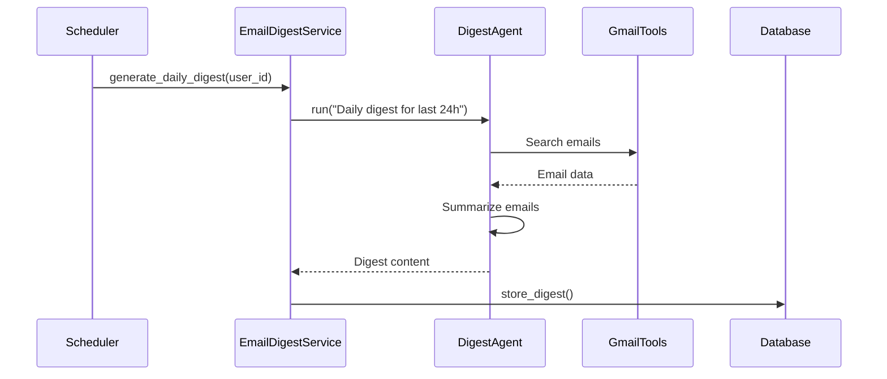
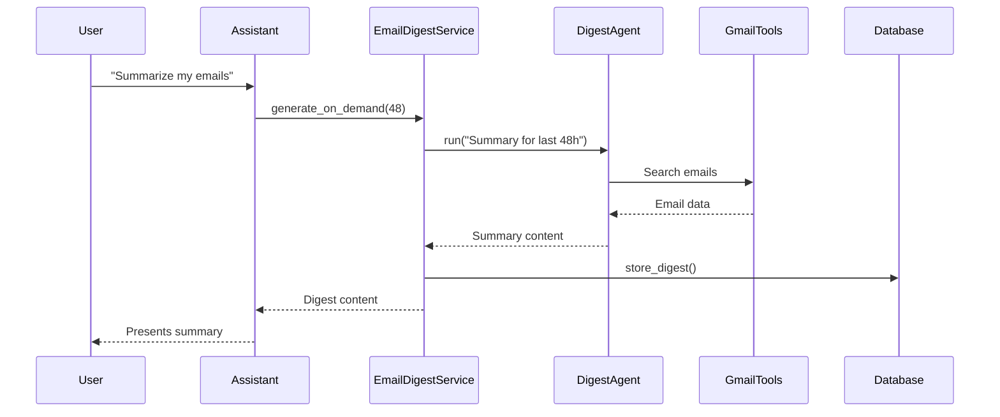

# Revised Email Digest Architecture Specification

## 1. Component Definitions

### Core Services
- **EmailDigestService** (`services/email_digest.py`)
  - `generate_daily_digest(user_id: str)`
  - `generate_on_demand(user_id: str, hours_back: int)`
  - `store_digest(user_id: str, content: str, digest_type: str)`

### Agent Configuration
- **Digest Agent Config** (Database stored)
  - Name: `email_digest_agent`
  - System prompt: Specialized for email summarization
  - Tools: `gmail_search`, `gmail_get_message`
  - LLM: `gemini-pro`

### Tool Registration
- **Gmail Tools** (Registered via tool registry)
  - `gmail_search`: LangChain's GmailSearchTool
  - `gmail_get_message`: LangChain's GmailGetMessageTool

### Database
- **email_digests Table** (Existing schema + enhancements)
```sql
ALTER TABLE email_digests
ADD COLUMN digest_type VARCHAR(20),        -- 'daily' or 'on-demand'
ADD COLUMN tags TEXT[];                    -- For categorization
```

## 2. Execution Flow

### Scheduled Digest Generation


### On-Demand Summary


## 3. File Structure
```
chatServer/
├── services/
│   ├── email_digest.py       # EmailDigestService
│   └── ...
└── tool_registry.py          # Central tool registration
```

## 4. Agent Integration
Agents are loaded directly using existing patterns:
```python
# In email_digest.py
from src.core.agent_loader import load_agent_executor

def process_digest_request(user_id: str, query: str):
    agent = load_agent_executor(
        agent_name="email_digest_agent",
        user_id=user_id
    )
    return agent.ainvoke({"input": query})
```

## 5. Tool Registration
Tools are registered via the CRUD tool pattern:
```python
# In tool_registry.py
from langchain_community.tools.gmail import GmailSearchTool, GmailGetMessageTool
from src.core.tools.crud_tool import register_tool

register_tool(
    name="gmail_search",
    tool=GmailSearchTool(),
    description="Search Gmail using query syntax"
)

register_tool(
    name="gmail_get_message",
    tool=GmailGetMessageTool(),
    description="Get full email content by message ID"
)
```

## 5. Efficiency Optimization
- **Map-Reduce Summarization**:
  ```python
  def summarize_emails(emails):
      # Phase 1: Extractive summarization
      key_points = [extract_key_points(email) for email in emails]
      
      # Phase 2: Abstractive summarization
      return llm_abstractive_summary(key_points)
  ```

## 6. Next Steps
1. Implement core services and agents
2. Update database schema
3. Integrate with assistant memory system
4. Add monitoring for LLM efficiency

This specification provides the granular details requested, including file paths, class/method definitions, and clear flow diagrams. Would you like to make any adjustments before I proceed?