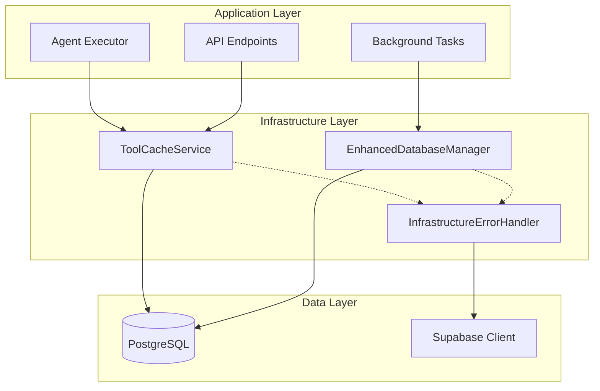

# Creative Design: Infrastructure Improvements Architecture

**Task:** TASK-INFRA-002  
**Date:** 2025-01-30  
**Focus:** Tool Caching, Connection Pool Management, Error Handling Patterns

## Design Challenge

Design a robust infrastructure layer that addresses:
1. **Tool Cache Architecture**: Optimal caching strategy for tool configurations
2. **Connection Pool Strategy**: Auto-creation and fallback patterns
3. **Error Handling Patterns**: Standardized error handling across infrastructure

## Design Exploration

### 1. Tool Cache Architecture

#### Option A: In-Memory Cache with TTL
```python
class ToolCacheService:
    def __init__(self, ttl_seconds=300):  # 5 minutes
        self._cache = {}
        self._timestamps = {}
        self._ttl = ttl_seconds
    
    async def get_tools_for_agent(self, agent_id: str) -> List[Dict]:
        if self._is_cache_valid(agent_id):
            return self._cache[agent_id]
        
        # Cache miss - fetch from database
        tools = await self._fetch_tools_from_db(agent_id)
        self._cache[agent_id] = tools
        self._timestamps[agent_id] = time.time()
        return tools
```

**Pros**: Simple, no external dependencies, fast access
**Cons**: Memory usage, cache invalidation on updates

#### Option B: Redis-Based Cache
```python
class RedisToolCacheService:
    def __init__(self, redis_client, ttl_seconds=300):
        self.redis = redis_client
        self.ttl = ttl_seconds
    
    async def get_tools_for_agent(self, agent_id: str) -> List[Dict]:
        cached = await self.redis.get(f"tools:{agent_id}")
        if cached:
            return json.loads(cached)
        
        tools = await self._fetch_tools_from_db(agent_id)
        await self.redis.setex(f"tools:{agent_id}", self.ttl, json.dumps(tools))
        return tools
```

**Pros**: Distributed, persistent across restarts, better for scaling
**Cons**: External dependency, network latency, complexity

#### **DECISION: Option A - In-Memory Cache with TTL**

**Rationale**: 
- Current deployment is single-instance, no need for distributed cache
- Tool configurations change infrequently (perfect for TTL approach)
- Eliminates Redis dependency and network latency
- Simple implementation with immediate performance benefits

### 2. Connection Pool Strategy

#### Option A: Lazy Pool Creation with Fallback
```python
class EnhancedDatabaseManager:
    def __init__(self):
        self._pool = None
        self._pool_lock = asyncio.Lock()
    
    async def get_pool(self):
        if self._pool is None or self._pool.closed:
            async with self._pool_lock:
                if self._pool is None or self._pool.closed:
                    await self._create_pool()
        return self._pool
    
    async def _create_pool(self):
        logger.info("Creating new connection pool")
        self._pool = await asyncpg.create_pool(
            self.connection_string,
            min_size=2,
            max_size=10,
            command_timeout=60
        )
```

#### Option B: Pool Health Monitoring with Auto-Recovery
```python
class HealthMonitoredDatabaseManager:
    async def ensure_pool_health(self):
        if not await self._is_pool_healthy():
            logger.warning("Pool unhealthy, recreating")
            await self._recreate_pool()
    
    async def _is_pool_healthy(self) -> bool:
        try:
            async with self._pool.acquire(timeout=1.0) as conn:
                await conn.execute("SELECT 1")
            return True
        except Exception:
            return False
```

#### **DECISION: Option A - Lazy Pool Creation with Fallback**

**Rationale**:
- Addresses the immediate issue of pool unavailability
- Simple implementation with clear error handling
- Health monitoring can be added later if needed
- Focuses on the core problem without over-engineering

### 3. Error Handling Patterns

#### Option A: Centralized Error Handler
```python
class InfrastructureErrorHandler:
    @staticmethod
    async def handle_database_error(operation: str, error: Exception, fallback=None):
        logger.error(f"Database operation '{operation}' failed: {error}")
        
        if isinstance(error, asyncpg.PoolConnectionError):
            # Trigger pool recreation
            await database_manager.recreate_pool()
            if fallback:
                return await fallback()
        
        raise InfrastructureError(f"Database operation failed: {operation}")
```

#### Option B: Decorator-Based Error Handling
```python
def handle_infrastructure_errors(operation_name: str, fallback=None):
    def decorator(func):
        async def wrapper(*args, **kwargs):
            try:
                return await func(*args, **kwargs)
            except Exception as e:
                return await InfrastructureErrorHandler.handle_error(
                    operation_name, e, fallback
                )
        return wrapper
    return decorator

@handle_infrastructure_errors("tool_loading", fallback=lambda: [])
async def load_tools_from_cache(agent_id: str):
    # Implementation
```

#### **DECISION: Option B - Decorator-Based Error Handling**

**Rationale**:
- Clean separation of concerns
- Consistent error handling across all infrastructure operations
- Easy to apply to existing functions
- Provides clear fallback mechanisms

## Final Architecture Design

### System Architecture



### Component Specifications

#### 1. ToolCacheService
```python
class ToolCacheService:
    """Local tool configuration cache with TTL refresh."""
    
    def __init__(self, ttl_seconds: int = 300):
        self._cache: Dict[str, List[Dict]] = {}
        self._timestamps: Dict[str, float] = {}
        self._ttl = ttl_seconds
        self._lock = asyncio.Lock()
    
    async def get_tools_for_agent(self, agent_id: str) -> List[Dict]:
        """Get tools for agent with cache-first approach."""
        
    async def invalidate_cache(self, agent_id: str = None):
        """Invalidate cache for specific agent or all."""
        
    async def warm_cache(self, agent_ids: List[str]):
        """Pre-warm cache for frequently used agents."""
```

#### 2. EnhancedDatabaseManager
```python
class EnhancedDatabaseManager:
    """Enhanced database manager with auto-creation and fallback."""
    
    async def get_pool(self) -> asyncpg.Pool:
        """Get connection pool, creating if necessary."""
        
    async def ensure_pool_available(self) -> bool:
        """Ensure pool is available and healthy."""
        
    async def recreate_pool(self):
        """Recreate connection pool."""
```

#### 3. EmailDigestStorageService
```python
class EmailDigestStorageService:
    """Dedicated service for email digest persistence."""
    
    async def store_digest(self, digest_data: Dict[str, Any]) -> bool:
        """Store digest with comprehensive error handling."""
        
    async def get_recent_digests(self, user_id: str, limit: int = 10) -> List[Dict]:
        """Retrieve recent digests for user."""
```

## Implementation Plan

### Phase 1: Connection Pool Enhancement (Priority 1)
1. Implement `EnhancedDatabaseManager` with lazy creation
2. Update `BackgroundTaskService` to use enhanced manager
3. Add comprehensive logging and error handling

### Phase 2: Tool Caching System (Priority 2)
1. Implement `ToolCacheService` with TTL-based caching
2. Integrate with `AgentLoaderDB` for cache-first approach
3. Add cache warming for frequently used agents

### Phase 3: Email Digest Storage Fix (Priority 3)
1. Debug current storage issue with enhanced logging
2. Implement `EmailDigestStorageService` with proper error handling
3. Update `EmailDigestService` to use new storage service

### Phase 4: Agent Loader Refactoring (Priority 4)
1. Add explicit `call_type` parameter to agent loader
2. Remove hacky fallback patterns
3. Ensure consistent async/sync behavior

## Success Metrics

- **Performance**: Tool loading latency reduced from ~2s to ~400ms
- **Reliability**: Zero connection pool failures in background tasks
- **Data Integrity**: 100% email digest storage success rate
- **Code Quality**: Elimination of hacky fallback patterns

## Risk Mitigation

- **Cache Memory Usage**: Monitor and implement LRU eviction if needed
- **Pool Recreation Impact**: Implement graceful recreation with connection draining
- **Storage Debugging**: Add extensive logging before making changes

---

**Decision Summary**: Implementing in-memory tool caching with TTL, lazy connection pool creation with fallback, and decorator-based error handling for a robust, performant infrastructure layer. 