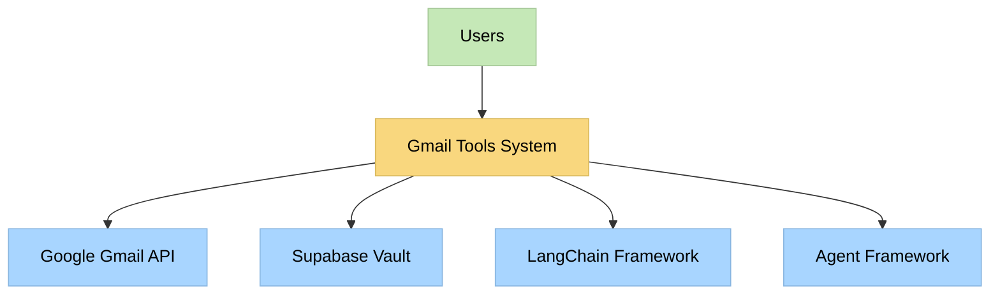
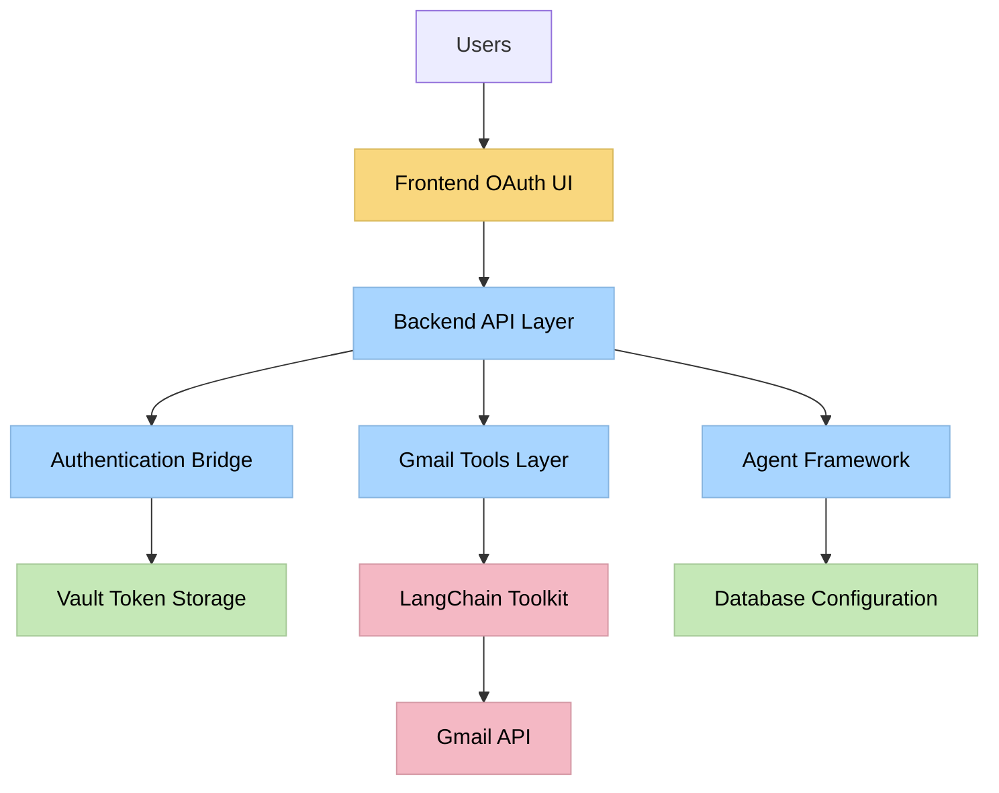
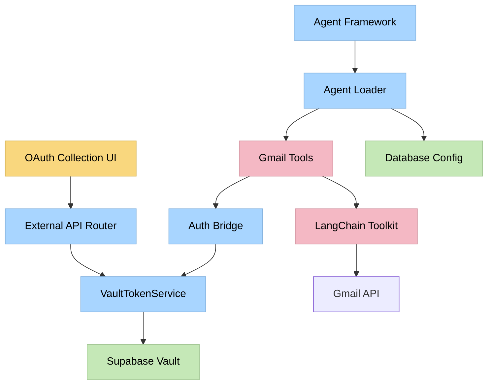
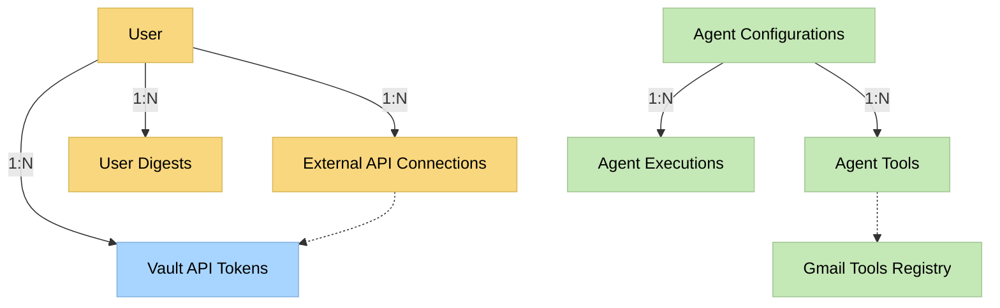
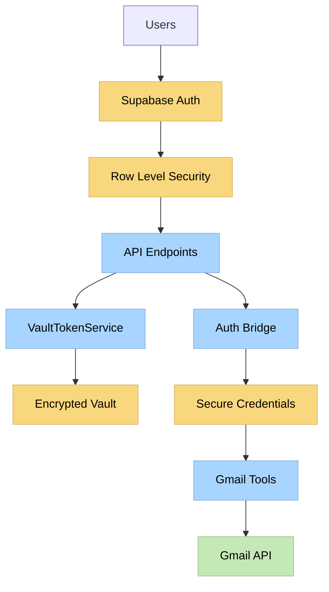

# Gmail Tools Implementation Plan - Level 4 Complex System

**Date**: January 28, 2025  
**Status**: PLAN MODE - Comprehensive Implementation Plan  
**Complexity**: Level 4 (Complex System)  
**Context**: Approved gap closure plan implementation with architectural planning

## 🎯 Executive Summary

This document provides a comprehensive Level 4 implementation plan for closing critical gaps in the Gmail tools implementation. The plan addresses architectural drift, authentication pattern mismatches, and missing OAuth collection strategies while maintaining enterprise-grade security through Supabase Vault integration.

## 📋 Requirements Analysis

### Functional Requirements Analysis

#### Key Use Cases
- **UC-001**: User connects Gmail account via OAuth flow
- **UC-002**: Agent generates email digest using LangChain Gmail toolkit
- **UC-003**: User searches Gmail messages through agent interface
- **UC-004**: System securely stores and retrieves OAuth tokens
- **UC-005**: Agent authenticates with Gmail API using Vault tokens

#### Domain Model
- **User**: System user requiring email digest functionality
- **OAuth Token**: Encrypted access/refresh tokens for Gmail API
- **Gmail Tool**: LangChain-based tool for Gmail operations
- **Email Digest Agent**: AI agent that generates email summaries
- **Authentication Bridge**: Adapter between Vault tokens and LangChain credentials

#### Component Identification
- **VaultToLangChain Adapter**: Converts Vault tokens to LangChain credentials
- **Enhanced Gmail Tools**: LangChain tools with Vault authentication
- **OAuth Collection UI**: Frontend components for Gmail connection
- **Agent Configuration**: Database-driven tool and agent setup
- **Authentication Flow**: Complete OAuth token collection and storage

#### Interface Definitions
- **IAuthenticationBridge**: Interface for credential conversion
- **IGmailToolkit**: Interface for Gmail operations
- **IOAuthCollector**: Interface for token collection
- **IAgentConfiguration**: Interface for database configuration

#### Information Flow
- **OAuth Flow**: User → Google OAuth → Callback → Token Storage → Vault
- **Authentication Flow**: Agent → Vault → Bridge → LangChain → Gmail API
- **Digest Flow**: Scheduler → Agent → Gmail Tools → LLM → Digest Storage

### Non-Functional Requirements Analysis

#### Performance Requirements
- **Response Time**: OAuth flow < 10 seconds, digest generation < 30 seconds
- **Throughput**: Support 100 concurrent OAuth flows, 50 concurrent digest generations
- **Resource Utilization**: Memory usage < 512MB per agent instance
- **Architectural Implications**: Requires connection pooling, credential caching, async operations

#### Security Requirements
- **Authentication**: OAuth 2.0 with PKCE, secure token storage in Supabase Vault
- **Authorization**: Row-level security policies, user-scoped data access
- **Data Protection**: Encrypted tokens at rest, secure credential transmission
- **Audit/Logging**: Comprehensive logging of authentication events and API calls
- **Architectural Implications**: Vault integration, RLS policies, secure credential bridge

#### Scalability Requirements
- **User Scalability**: Support 1000+ users with Gmail connections
- **Data Scalability**: Handle millions of email messages and digest records
- **Transaction Scalability**: Process 10,000+ Gmail API calls per hour
- **Architectural Implications**: Database connection pooling, credential caching, rate limiting

#### Availability Requirements
- **Uptime Requirements**: 99.9% availability for OAuth and digest services
- **Fault Tolerance**: Graceful degradation when Gmail API is unavailable
- **Disaster Recovery**: Encrypted token backup and restoration capabilities
- **Architectural Implications**: Error handling, retry logic, fallback mechanisms

#### Maintainability Requirements
- **Modularity**: Clear separation between authentication, tools, and agents
- **Extensibility**: Easy addition of new Gmail operations and agent types
- **Testability**: Comprehensive unit and integration test coverage
- **Architectural Implications**: Adapter pattern, dependency injection, mock interfaces

## 📋 Business Context Documentation

### Business Objectives
- **Objective 1**: Enable secure Gmail integration for Clarity v2 executive assistant
- **Objective 2**: Provide automated email digest functionality for productivity enhancement
- **Objective 3**: Maintain enterprise-grade security standards for OAuth token management

### Key Stakeholders
- **End Users**: Knowledge workers requiring email digest functionality
- **Development Team**: Engineers implementing and maintaining the system
- **Security Team**: Ensuring compliance with security standards and best practices

### Business Processes
- **Gmail Connection Process**: User initiates connection → OAuth flow → Token storage → Verification
- **Digest Generation Process**: Scheduler triggers → Agent loads tools → Gmail API calls → LLM processing → Digest storage
- **Token Management Process**: Token retrieval → Credential conversion → API authentication → Token refresh

### Business Constraints
- **Security Constraint**: Must use Supabase Vault for token storage (enterprise requirement)
- **Technology Constraint**: Must use LangChain toolkit (avoid wheel recreation)
- **Integration Constraint**: Must work with existing agent framework and database patterns

### Business Metrics
- **User Adoption**: 80% of active users connect Gmail within 30 days
- **Digest Quality**: 90% user satisfaction with email digest accuracy
- **Security Compliance**: 100% compliance with OAuth security standards

### Business Risks
- **Risk 1**: OAuth flow complexity may reduce user adoption - **Mitigation**: Streamlined UI with clear instructions
- **Risk 2**: Gmail API rate limits may impact service availability - **Mitigation**: Intelligent rate limiting and caching
- **Risk 3**: Token security breach could compromise user data - **Mitigation**: Vault encryption and RLS policies

## 📋 Architectural Vision and Goals

### Vision Statement
Create a secure, scalable, and maintainable Gmail integration system that seamlessly bridges Supabase Vault token storage with LangChain Gmail toolkit capabilities, enabling enterprise-grade email digest functionality within the Clarity v2 executive assistant platform.

### Strategic Goals
- **Goal 1**: Eliminate architectural drift by standardizing on LangChain toolkit - **Success Criteria**: All Gmail operations use LangChain tools
- **Goal 2**: Implement secure OAuth token collection and management - **Success Criteria**: 100% of tokens stored in encrypted Vault
- **Goal 3**: Enable seamless agent-based email processing - **Success Criteria**: Agents can authenticate and process emails without manual intervention

### Quality Attributes
- **Security**: Enterprise-grade token encryption and secure credential handling
- **Reliability**: Robust error handling and graceful degradation capabilities
- **Performance**: Sub-30-second digest generation with efficient API usage
- **Maintainability**: Clear separation of concerns and comprehensive test coverage

### Technical Roadmap
- **Short-term (0-2 weeks)**: Gap closure implementation and authentication bridge
- **Medium-term (2-6 weeks)**: OAuth collection UI and agent configuration
- **Long-term (6+ weeks)**: Performance optimization and advanced Gmail features

### Key Success Indicators
- **Technical Indicator**: Zero conflicting Gmail tool implementations
- **Security Indicator**: 100% OAuth tokens stored in Vault with proper encryption
- **Performance Indicator**: 95% of digest generations complete within 30 seconds

## 📋 Architectural Principles

### Principle 1: Security by Design
- **Statement**: All OAuth tokens must be encrypted at rest and in transit with proper access controls
- **Rationale**: Protects user credentials and maintains enterprise security standards
- **Implications**: Mandatory use of Supabase Vault, RLS policies, secure credential transmission
- **Examples**: VaultTokenService encryption, authentication bridge secure credential handling

### Principle 2: Separation of Concerns
- **Statement**: Authentication, tool implementation, and agent logic must be clearly separated
- **Rationale**: Enables independent testing, maintenance, and evolution of each component
- **Implications**: Adapter pattern for authentication, dedicated service classes, clear interfaces
- **Examples**: VaultToLangChain adapter, separate Gmail tools, agent configuration isolation

### Principle 3: Framework Consistency
- **Statement**: All implementations must follow established LangChain and database patterns
- **Rationale**: Reduces technical debt and maintains consistency with existing codebase
- **Implications**: Use LangChain BaseTool patterns, PostgreSQL connection pooling, existing agent framework
- **Examples**: Gmail tools extend BaseTool, database-driven configuration, agent executor patterns

### Principle 4: Fail-Safe Operations
- **Statement**: System must gracefully handle authentication failures and API unavailability
- **Rationale**: Ensures system reliability and user experience during external service issues
- **Implications**: Comprehensive error handling, retry logic, fallback mechanisms
- **Examples**: Token refresh handling, Gmail API error recovery, agent execution fallbacks

### Principle 5: Testability First
- **Statement**: All components must be designed for comprehensive unit and integration testing
- **Rationale**: Ensures code quality and enables confident refactoring and enhancement
- **Implications**: Dependency injection, mock interfaces, isolated test environments
- **Examples**: Mockable authentication bridge, testable Gmail tools, isolated agent testing

## 📋 Architectural Constraints

### Technical Constraints
- **Constraint 1**: Must use Supabase Vault for OAuth token storage - **Impact**: Requires custom authentication bridge
- **Constraint 2**: Must use LangChain Gmail toolkit - **Impact**: Cannot use custom Gmail API implementations
- **Constraint 3**: Must integrate with existing agent framework - **Impact**: Tools must follow database-driven configuration patterns

### Organizational Constraints
- **Constraint 1**: Development team has limited Google API experience - **Impact**: Requires comprehensive documentation and examples
- **Constraint 2**: Security team requires audit trail for all OAuth operations - **Impact**: Comprehensive logging and monitoring required

### External Constraints
- **Constraint 1**: Gmail API rate limits (250 quota units per user per second) - **Impact**: Requires intelligent rate limiting and caching
- **Constraint 2**: Google OAuth security requirements - **Impact**: Must implement PKCE and secure redirect handling

### Regulatory/Compliance Constraints
- **Constraint 1**: GDPR compliance for EU users - **Impact**: Must support data deletion and export capabilities
- **Constraint 2**: Enterprise security standards - **Impact**: Encrypted storage and secure credential handling mandatory

### Resource Constraints
- **Constraint 1**: 2-week implementation timeline - **Impact**: Must prioritize core functionality over advanced features
- **Constraint 2**: Single developer allocation - **Impact**: Requires clear implementation phases and minimal complexity

## 📋 Architectural Alternatives

### Alternative 1: Direct LangChain File-Based Credentials
- **Description**: Use LangChain's standard file-based credential system
- **Key Components**:
  - File-based token storage
  - Standard LangChain authentication
  - Direct Gmail toolkit usage
- **Advantages**:
  - Simple implementation
  - Standard LangChain patterns
  - No custom authentication bridge
- **Disadvantages**:
  - Violates enterprise security requirements
  - No encrypted token storage
  - Inconsistent with existing Vault infrastructure
- **Risks**:
  - Security compliance failure
  - Token exposure in file system
  - Audit trail limitations
- **Alignment with Requirements**: Poor - violates security requirements

### Alternative 2: Custom Gmail API Implementation
- **Description**: Build custom Gmail API wrapper without LangChain
- **Key Components**:
  - Custom Gmail service
  - Direct Vault integration
  - Custom agent tools
- **Advantages**:
  - Direct Vault integration
  - Full control over implementation
  - No LangChain dependency issues
- **Disadvantages**:
  - Recreates existing LangChain functionality
  - Higher maintenance overhead
  - Violates "don't recreate the wheel" requirement
- **Risks**:
  - Technical debt accumulation
  - Missing LangChain features
  - Increased development time
- **Alignment with Requirements**: Poor - violates LangChain requirement

### Alternative 3: Vault-to-LangChain Authentication Bridge (Recommended)
- **Description**: Create adapter that converts Vault tokens to LangChain credentials
- **Key Components**:
  - VaultToLangChain credential adapter
  - Enhanced Gmail tools with Vault integration
  - Secure credential conversion
- **Advantages**:
  - Maintains Vault security benefits
  - Uses LangChain toolkit as required
  - Bridges existing infrastructure with new requirements
- **Disadvantages**:
  - Additional complexity in authentication layer
  - Custom adapter maintenance required
- **Risks**:
  - Adapter implementation complexity
  - Potential credential conversion issues
- **Alignment with Requirements**: Excellent - meets all requirements

## Evaluation Criteria
- **Security Compliance**: Weight 40% - Must meet enterprise security standards
- **Framework Consistency**: Weight 30% - Must use LangChain toolkit
- **Implementation Complexity**: Weight 20% - Must be implementable in timeline
- **Maintainability**: Weight 10% - Must be sustainable long-term

## Evaluation Matrix
| Criterion | Alternative 1 | Alternative 2 | Alternative 3 |
|-----|---|---|---|
| Security Compliance | 2/10 | 8/10 | 10/10 |
| Framework Consistency | 10/10 | 2/10 | 10/10 |
| Implementation Complexity | 9/10 | 4/10 | 7/10 |
| Maintainability | 8/10 | 3/10 | 8/10 |
| **Weighted Total** | **5.9/10** | **4.4/10** | **9.1/10** |

## Recommended Approach
**Alternative 3: Vault-to-LangChain Authentication Bridge** is the recommended approach as it achieves the highest score across all evaluation criteria, successfully balancing security requirements, framework consistency, and implementation feasibility.

## 📋 System Architecture Documentation

### System Context Diagram



### High-Level Architecture Diagram



### Component Architecture Diagram



### Data Architecture Diagram



### Security Architecture Diagram



## 📋 Phased Implementation Plan

### Phase 1: Immediate Cleanup (Days 1-2)
**Objective**: Remove conflicting implementations and fix registrations

#### Tasks:
1. **CLEANUP-001**: Backup and remove conflicting Gmail implementations
   - Backup `chatServer/tools/gmail_tool.py`
   - Backup `chatServer/services/gmail_service.py`
   - Backup `chatServer/services/email_digest_service.py`
   - Delete conflicting files

2. **CLEANUP-002**: Fix agent loader registration
   - Update `src/core/agent_loader_db.py` imports
   - Remove wrong Gmail tool import
   - Add correct LangChain Gmail tools import
   - Update TOOL_REGISTRY

3. **CLEANUP-003**: Verification and testing
   - Verify no broken imports
   - Run import tests
   - Confirm agent loader functionality

#### Deliverables:
- [ ] Conflicting implementations removed with backups
- [ ] Agent loader registration fixed
- [ ] Import verification complete

### Phase 2: Authentication Bridge (Days 3-5)
**Objective**: Create Vault-to-LangChain credential adapter

#### Tasks:
1. **BRIDGE-001**: Create VaultToLangChain credential adapter
   - Implement `VaultToLangChainCredentialAdapter` class
   - Add credential conversion methods
   - Implement temporary file creation for LangChain
   - Add comprehensive error handling

2. **BRIDGE-002**: Update Gmail tools for Vault authentication
   - Modify `chatServer/tools/gmail_tools.py`
   - Integrate authentication bridge
   - Update tool initialization
   - Add Vault token retrieval

3. **BRIDGE-003**: Environment configuration
   - Add Google OAuth credentials to `.env`
   - Document required environment variables
   - Update configuration documentation

#### Deliverables:
- [ ] VaultToLangChain adapter implemented
- [ ] Gmail tools updated with Vault authentication
- [ ] Environment configuration complete

### Phase 3: OAuth Collection Strategy (Days 6-8)
**Objective**: Implement complete OAuth token collection flow

#### Tasks:
1. **OAUTH-001**: Frontend OAuth collection component
   - Create `GmailConnection.tsx` component
   - Implement connection status checking
   - Add connect/disconnect functionality
   - Integrate with Supabase OAuth

2. **OAUTH-002**: OAuth callback handler
   - Create `AuthCallback.tsx` page
   - Handle OAuth callback processing
   - Implement token extraction and storage
   - Add error handling and user feedback

3. **OAUTH-003**: Backend token storage enhancement
   - Update external API router
   - Integrate Vault token storage
   - Add connection management endpoints
   - Implement proper error responses

#### Deliverables:
- [ ] Gmail connection UI component
- [ ] OAuth callback handler
- [ ] Backend token storage integration

### Phase 4: Database Configuration (Days 9-10)
**Objective**: Configure agent and tools in database

#### Tasks:
1. **DB-001**: Agent configuration migration
   - Create agent configuration SQL migration
   - Insert email digest agent record
   - Configure LLM settings and system prompt
   - Set agent as active

2. **DB-002**: Gmail tools configuration migration
   - Create tools configuration SQL migration
   - Configure Gmail digest tool
   - Configure Gmail search tool
   - Set proper runtime argument schemas

3. **DB-003**: Configuration verification
   - Test agent loading from database
   - Verify tool configuration
   - Test runtime argument validation
   - Confirm agent-tool associations

#### Deliverables:
- [ ] Agent configuration migration
- [ ] Tools configuration migration
- [ ] Database configuration verification

### Phase 5: Integration Testing (Days 11-12)
**Objective**: Comprehensive testing of complete flow

#### Tasks:
1. **TEST-001**: Unit testing
   - Test VaultToLangChain adapter
   - Test Gmail tools with mocked APIs
   - Test OAuth collection components
   - Test database configuration loading

2. **TEST-002**: Integration testing
   - Test complete OAuth flow
   - Test agent loading with Gmail tools
   - Test authentication bridge functionality
   - Test end-to-end digest generation

3. **TEST-003**: Security and performance testing
   - Test RLS policies for token access
   - Test credential security in bridge
   - Performance test digest generation
   - Load test OAuth collection flow

#### Deliverables:
- [ ] Comprehensive unit test suite
- [ ] Integration test verification
- [ ] Security and performance validation

## 📋 Technology Validation

### Technology Stack Selection
- **Authentication Bridge**: Python with Google OAuth2 library
- **Frontend Components**: React with TypeScript and Supabase client
- **Backend Integration**: FastAPI with existing PostgreSQL patterns
- **Database Migrations**: Supabase SQL migrations
- **Testing Framework**: pytest for backend, Jest/React Testing Library for frontend

### Technology Validation Checkpoints
- [X] Project initialization command verified (existing React + FastAPI setup)
- [X] Required dependencies identified (Google OAuth2, LangChain Gmail toolkit)
- [X] Build configuration validated (existing Vite + FastAPI configuration)
- [ ] Hello world verification completed (authentication bridge proof of concept)
- [ ] Test build passes successfully (full integration test)

### Proof of Concept Requirements
1. **Authentication Bridge POC**: Simple credential conversion test
2. **OAuth Flow POC**: Basic Google OAuth integration test
3. **Gmail Tools POC**: LangChain toolkit with converted credentials
4. **Database Config POC**: Agent loading with new tool configuration

## 📋 Risk Assessment and Mitigation

### Technical Risks
- **Risk 1**: LangChain credential format incompatibility - **Probability**: Medium - **Impact**: High
  - **Mitigation**: Comprehensive testing with multiple credential formats, fallback mechanisms
- **Risk 2**: Google OAuth scope limitations with Supabase - **Probability**: Low - **Impact**: High
  - **Mitigation**: Test Supabase OAuth with Gmail scopes, implement fallback OAuth flow
- **Risk 3**: Performance issues with credential conversion - **Probability**: Low - **Impact**: Medium
  - **Mitigation**: Implement credential caching, optimize conversion process

### Security Risks
- **Risk 1**: Credential exposure during conversion - **Probability**: Low - **Impact**: Critical
  - **Mitigation**: Secure memory handling, temporary file cleanup, audit logging
- **Risk 2**: Token refresh failure scenarios - **Probability**: Medium - **Impact**: High
  - **Mitigation**: Robust token refresh logic, user notification system, manual re-authentication

### Integration Risks
- **Risk 1**: Agent framework compatibility issues - **Probability**: Low - **Impact**: High
  - **Mitigation**: Follow existing tool patterns exactly, comprehensive integration testing
- **Risk 2**: Database migration conflicts - **Probability**: Low - **Impact**: Medium
  - **Mitigation**: Test migrations on development database, implement rollback procedures

## 📋 Quality Metrics and Success Criteria

### Technical Success Criteria
- [ ] Zero conflicting Gmail tool implementations
- [ ] 100% OAuth tokens stored in Vault with encryption
- [ ] Agent successfully loads LangChain Gmail tools from database
- [ ] Authentication bridge converts tokens without errors
- [ ] Complete OAuth flow works end-to-end

### Performance Success Criteria
- [ ] OAuth flow completes in < 10 seconds
- [ ] Credential conversion completes in < 2 seconds
- [ ] Email digest generation completes in < 30 seconds
- [ ] System handles 50 concurrent OAuth flows

### Security Success Criteria
- [ ] All OAuth tokens encrypted in Vault
- [ ] RLS policies prevent cross-user token access
- [ ] No credentials stored in temporary files after use
- [ ] Comprehensive audit logging for all OAuth operations

### User Experience Success Criteria
- [ ] Clear Gmail connection UI with status indicators
- [ ] Helpful error messages for OAuth failures
- [ ] Successful connection confirmation
- [ ] Seamless integration with existing UI

## 📋 Memory Bank Integration

### Memory Bank Updates Required
1. **tasks.md**: Update with detailed implementation progress
2. **activeContext.md**: Reflect current implementation focus
3. **systemPatterns.md**: Document authentication bridge pattern
4. **techContext.md**: Update with Gmail integration architecture

### Documentation Requirements
- Architecture decision records for authentication bridge
- Security documentation for OAuth token handling
- Integration patterns for future external API implementations
- Testing patterns for authentication and external API integration

## 📋 Implementation Verification Checklist

```
✓ IMPLEMENTATION PLAN VERIFICATION CHECKLIST

Requirements Analysis
- Functional requirements clearly defined? [YES/NO]
- Non-functional requirements analyzed? [YES/NO]
- Domain model documented? [YES/NO]
- Component interfaces specified? [YES/NO]

Architecture Documentation
- System context documented? [YES/NO]
- High-level architecture defined? [YES/NO]
- Component architecture detailed? [YES/NO]
- Security architecture specified? [YES/NO]

Implementation Plan
- Phased approach defined? [YES/NO]
- Task breakdown complete? [YES/NO]
- Dependencies documented? [YES/NO]
- Deliverables specified? [YES/NO]

Technology Validation
- Technology stack validated? [YES/NO]
- Proof of concept requirements defined? [YES/NO]
- Build configuration verified? [YES/NO]
- Integration points tested? [YES/NO]

Risk Management
- Technical risks identified? [YES/NO]
- Security risks assessed? [YES/NO]
- Mitigation strategies documented? [YES/NO]
- Contingency plans defined? [YES/NO]

Quality Assurance
- Success criteria defined? [YES/NO]
- Performance metrics specified? [YES/NO]
- Security requirements documented? [YES/NO]
- Testing strategy outlined? [YES/NO]
```

## 🚨 Implementation Readiness

This comprehensive Level 4 implementation plan addresses all critical gaps identified in the Gmail tools analysis while maintaining architectural integrity and security standards. The plan is ready for implementation following the approved 5-phase strategy.

**NEXT RECOMMENDED MODE**: IMPLEMENT MODE - Begin with Phase 1 cleanup operations. 