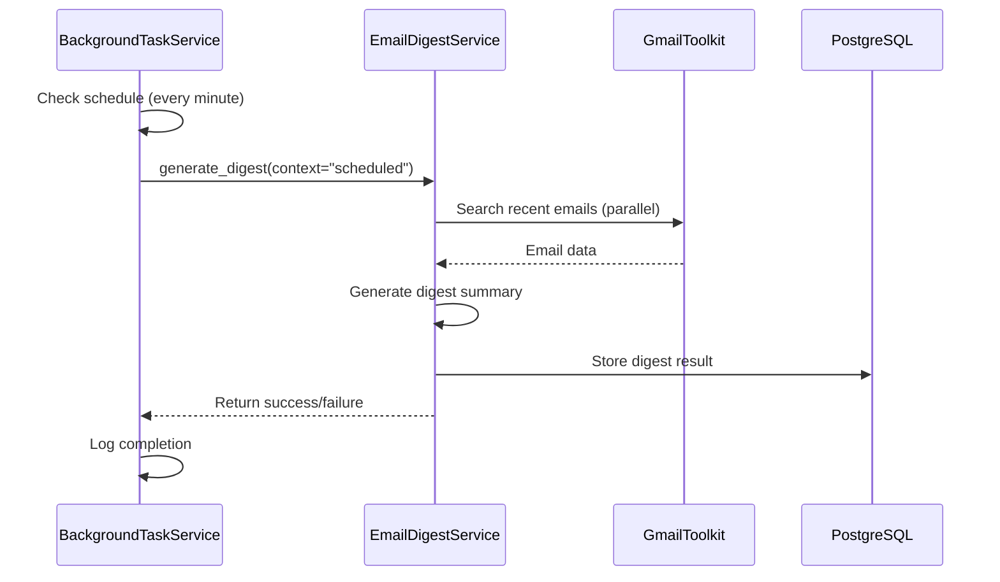
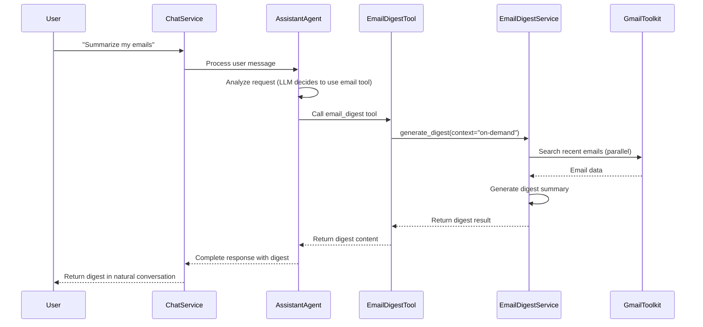

# 🏛️ Improved Architecture: Clarity Email Digest System

## 🎯 Core Design Principles
- **Leverage Existing Infrastructure**: Extend BackgroundTaskService and agent executor caching
- **LangChain Native**: Use LangChain Gmail toolkit directly, no custom wrappers
- **Latency Optimization**: Parallel execution and cached agent reuse
- **Minimal Complexity**: Simple scheduler extension, not new orchestrator

## 📐 System Architecture

### Current Infrastructure Analysis
✅ **Already Built**:
- `BackgroundTaskService` - Handles scheduled tasks (session cleanup)
- Agent executor caching - TTL-based cache for agent instances
- `PostgresChatMessageHistory` - Persistent memory system
- LangChain Gmail toolkit integration - Available but needs simplification

❌ **Missing Components**:
- Scheduled agent execution capability
- On-demand agent execution via chat
- Simplified Gmail tool configuration

## 🔧 Implementation Components

### 1. Enhanced BackgroundTaskService (Extend Existing)

```python
# chatServer/services/background_tasks.py - EXTEND
class BackgroundTaskService:
    def __init__(self):
        # ... existing code ...
        self.scheduled_agents_task: Optional[asyncio.Task] = None
        self.agent_schedules: Dict[str, Dict] = {}
    
    async def run_scheduled_agents(self) -> None:
        """Execute scheduled agents (like daily email digest)."""
        while True:
            await asyncio.sleep(60)  # Check every minute
            current_time = datetime.now()
            
            # Check for agents that need to run
            for schedule_id, schedule in self.agent_schedules.items():
                if self._should_run_now(schedule, current_time):
                    asyncio.create_task(self._execute_scheduled_agent(schedule))
    
    async def _execute_scheduled_agent(self, schedule: Dict):
        """Execute a single scheduled agent."""
        try:
            # Reuse existing agent executor cache
            executor = await self._get_cached_agent_executor(
                schedule['user_id'], 
                schedule['agent_name']
            )
            
            # Execute with schedule-specific input
            await executor.ainvoke({
                "input": schedule['prompt'],
                "chat_history": []  # Fresh context for scheduled runs
            })
        except Exception as e:
            logger.error(f"Scheduled agent execution failed: {e}")
```

### 2. Simplified Gmail Tools (Replace Existing)

```python
# chatServer/tools/gmail_tools.py - REPLACE
from langchain_google_community import GmailToolkit

class SimpleGmailToolProvider:
    """Simplified Gmail tool provider using pure LangChain toolkit."""
    
    def __init__(self, user_id: str):
        self.user_id = user_id
        self._toolkit = None
    
    async def get_gmail_tools(self) -> List[BaseTool]:
        """Get LangChain Gmail tools with Vault authentication."""
        if self._toolkit is None:
            # Use existing VaultTokenService for credentials
            vault_service = VaultTokenService()
            credentials = await vault_service.get_gmail_credentials(self.user_id)
            
            # Create LangChain Gmail toolkit directly
            self._toolkit = GmailToolkit(credentials=credentials)
        
        return self._toolkit.get_tools()
```

### 3. Unified Email Digest Service (Correct Approach)

```python
# chatServer/services/email_digest_service.py - NEW
class EmailDigestService:
    """Unified service for email digest generation - used by both scheduled tasks and tools."""
    
    def __init__(self, user_id: str):
        self.user_id = user_id
        self._gmail_provider = None
    
    async def generate_digest(
        self, 
        hours_back: int = 24, 
        include_read: bool = False,
        context: str = "scheduled"  # "scheduled" or "on-demand"
    ) -> Dict[str, Any]:
        """
        Unified entry point for email digest generation.
        Used by both BackgroundTaskService and EmailDigestTool.
        """
        try:
            # Get Gmail tools using existing VaultTokenService
            if self._gmail_provider is None:
                self._gmail_provider = SimpleGmailToolProvider(self.user_id)
            
            gmail_tools = await self._gmail_provider.get_gmail_tools()
            
            # Use Gmail search tool to find recent emails
            search_tool = next(tool for tool in gmail_tools if "search" in tool.name.lower())
            
            # Build search query for recent emails
            query = f"newer_than:{hours_back}h"
            if not include_read:
                query += " is:unread"
            
            # Execute search (parallel execution handled by LangChain)
            search_results = await search_tool.arun({"query": query, "max_results": 20})
            
            # Generate digest summary
            digest_content = self._create_digest_summary(search_results, hours_back, context)
            
            # Store result for scheduled digests
            if context == "scheduled":
                await self._store_digest_result({
                    "user_id": self.user_id,
                    "generated_at": datetime.now().isoformat(),
                    "hours_back": hours_back,
                    "include_read": include_read,
                    "digest": digest_content,
                    "context": context
                })
            
            return {
                "success": True,
                "digest": digest_content,
                "email_count": self._extract_email_count(search_results),
                "generated_at": datetime.now().isoformat()
            }
            
        except Exception as e:
            logger.error(f"Email digest generation failed for user {self.user_id}: {e}")
            return {
                "success": False,
                "error": str(e),
                "digest": f"Failed to generate email digest: {e}"
            }

# chatServer/tools/email_digest_tool.py - NEW
class EmailDigestTool(BaseTool):
    """Tool that calls the unified EmailDigestService."""
    
    name: str = "email_digest"
    description: str = (
        "Generate a digest of recent emails from Gmail. "
        "Use this when the user asks about emails, inbox summary, or email digest."
    )
    args_schema: Type[BaseModel] = EmailDigestInput
    
    user_id: str
    
    async def _arun(self, hours_back: int = 24, include_read: bool = False) -> str:
        """Generate email digest by calling unified service."""
        service = EmailDigestService(self.user_id)
        result = await service.generate_digest(
            hours_back=hours_back,
            include_read=include_read,
            context="on-demand"
        )
        
        if result["success"]:
            return result["digest"]
        else:
            return result["digest"]  # Contains error message

# chatServer/services/background_tasks.py - EXTEND
class BackgroundTaskService:
    async def _execute_scheduled_agent(self, schedule: Dict):
        """Execute scheduled email digest using unified service."""
        try:
            # Use the same service that the tool uses
            service = EmailDigestService(schedule['user_id'])
            result = await service.generate_digest(
                hours_back=schedule.get('hours_back', 24),
                include_read=schedule.get('include_read', False),
                context="scheduled"
            )
            
            if result["success"]:
                logger.info(f"Scheduled email digest completed for user {schedule['user_id']}")
            else:
                logger.error(f"Scheduled email digest failed: {result['error']}")
                
        except Exception as e:
            logger.error(f"Scheduled agent execution failed: {e}")
```

## 🗓️ Scheduling System

### Daily Digest Workflow


### On-Demand Workflow


## 🔄 What Gets Simplified

### ❌ Components to Remove/Simplify
- **Complex EmailDigestAgent class** → Use generic agent with Gmail toolkit
- **Custom Gmail tool wrappers** → Use LangChain Gmail toolkit directly
- **EmailDigestScheduler** → Integrate into BackgroundTaskService
- **Bloated gmail_tools.py** → Replace with simple toolkit provider

### ✅ Components to Keep & Enhance
- **BackgroundTaskService** → Extend with agent scheduling
- **Agent executor caching** → Reuse for scheduled agents
- **VaultTokenService** → Keep for secure OAuth token management
- **PostgreSQL memory** → Use for digest storage and agent memory

## 🎯 Alignment with Requirements

### ✅ Scheduled Agent Execution
- **Daily digest at 7:30 AM** → BackgroundTaskService extension with dedicated email digest agent
- **Configurable schedules** → Database-driven schedule configuration
- **Agent reuse** → Leverage existing executor cache for scheduled agents

### ✅ On-Demand Execution
- **Chat integration** → EmailDigestTool available to assistant agent
- **Natural conversation** → Assistant agent uses email digest tool when appropriate
- **LLM decision making** → Agent decides when to use email digest tool based on user input
- **Single session** → User stays in conversation with assistant agent

### ✅ Latency Optimization
- **Parallel tool execution** → LangChain Gmail toolkit handles parallelization within EmailDigestTool
- **Agent caching** → Assistant agent remains cached, email digest tool is lightweight
- **Tool composition** → EmailDigestTool composes Gmail tools for efficient execution

## 📋 Implementation Plan

### Phase 1: BackgroundTaskService Extension (2 days)
1. Add scheduled agent execution to BackgroundTaskService
2. Create schedule configuration system
3. Integrate with existing agent executor cache

### Phase 2: Gmail Tools Simplification (1 day)
1. Replace complex gmail_tools.py with simple toolkit provider
2. Use LangChain Gmail toolkit directly
3. Integrate with existing VaultTokenService

### Phase 3: Chat Service Integration (1 day)
1. Add email digest request detection to ChatService
2. Implement on-demand agent execution
3. Optimize prompts for different execution contexts

### Phase 4: Configuration & Testing (1 day)
1. Database configuration for scheduled agents
2. Integration testing with existing infrastructure
3. Performance optimization and monitoring

## 🚀 Benefits of This Approach

### ✅ Unified Service Architecture
- **Single source of truth** → EmailDigestService handles all digest generation
- **Consistent behavior** → Same logic for scheduled and on-demand execution
- **Shared caching** → Gmail provider cached within service instance
- **DRY principle** → No code duplication between scheduled and on-demand paths

### ✅ Leverages Existing Infrastructure
- **No new orchestrator needed** → Extend BackgroundTaskService
- **Reuses agent patterns** → Assistant agent uses standard tool interface
- **Uses established patterns** → PostgreSQL memory, LangChain tools, VaultTokenService

### ✅ Addresses Latency Issues
- **Parallel execution** → LangChain toolkit handles Gmail API calls in parallel
- **Service-level caching** → Gmail provider cached per service instance
- **Lightweight tool** → EmailDigestTool is just a thin wrapper around service
- **No agent switching** → User stays in conversation with assistant agent

### ✅ Simplified Architecture
- **Fewer moving parts** → Service layer handles complexity
- **Clear separation** → Tool layer vs service layer vs infrastructure layer
- **Maintainable** → Standard service patterns with dependency injection
- **Testable** → Service can be unit tested independently

This architecture provides exactly what you need: scheduled email digests + on-demand email summaries while leveraging existing infrastructure and avoiding the complexity of a new orchestrator system.
