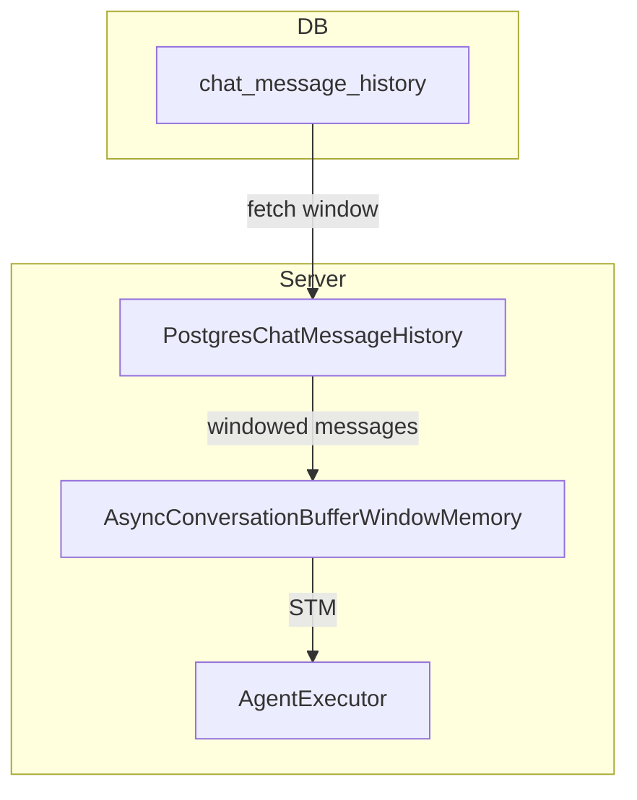
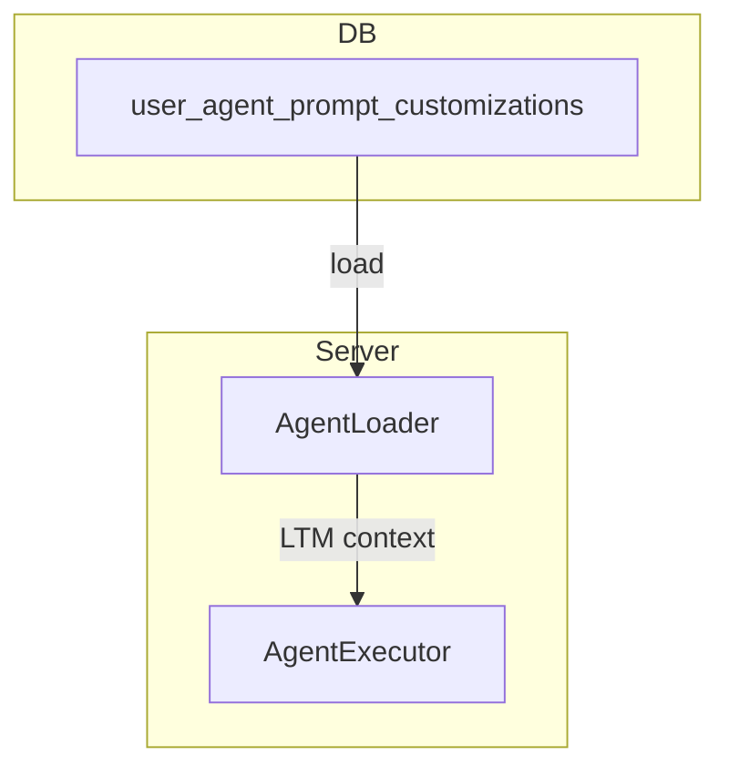
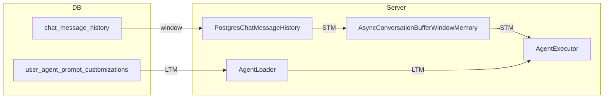

# Memory System v2: Short-Term and Long-Term Memory Architecture

## Overview
This document describes the architecture and implementation of both Short-Term Memory (STM) and Long-Term Memory (LTM) in the chat application, as realized in `chatServer/main.py`. It explains how these memory systems work together to provide context and continuity for agents, and how the system is designed for extensibility.

---

## 1. What is STM? What is LTM?

- **Short-Term Memory (STM):**
  - The *rolling window* of recent messages in a conversation, used by the agent to maintain context for ongoing dialog.
  - Implemented as a window (default: last 50 messages) over the persistent chat history for a given chat.
- **Long-Term Memory (LTM):**
  - *Persistent, structured, or summarized knowledge* that persists beyond the STM window and can be referenced or updated over time.
  - Currently realized as persistent prompt customizations (per user/agent), and architected for future expansion (summaries, embeddings, etc).

---

## 2. STM: Chat History and Windowing

- **Database:** All messages are stored in the `chat_message_history` table, keyed by `session_id` (which is the persistent `chat_id`).
- **Server:**
  - Uses `PostgresChatMessageHistory` (from `langchain_postgres`) to interface with this table.
  - On each `/api/chat` request, loads the relevant window of messages for the given `chat_id`.
  - Wraps this in an `AsyncConversationBufferWindowMemory` (custom async subclass) to provide a rolling window (default: 50 messages) as STM.
- **Agent:** Receives the STM window as part of its context for each invocation.

---

## 3. LTM: Prompt Customizations and Extensible Knowledge

- **Prompt Customizations:**
  - Stored in the `user_agent_prompt_customizations` table.
  - Each record is associated with a user and agent, and contains persistent instructions or context that influence agent behavior across all sessions.
  - On each agent invocation, relevant prompt customizations are loaded and injected into the agent's context.
- **Extensibility:**
  - The system is architected to support additional LTM features, such as:
    - Summaries of past conversations
    - Embeddings or knowledge base entries
    - Other persistent, structured memory
  - The agent loader and executor are designed to load such LTM context at agent instantiation or per request.

---

## 4. How STM and LTM Work Together

- On each `/api/chat` request:
  1. The server loads the STM window (recent messages) for the current `chat_id` from the database.
  2. The server loads any relevant LTM (prompt customizations, and potentially other persistent knowledge) for the user/agent.
  3. Both STM and LTM are injected into the agent's context for response generation.

---

## 5. Key Code and Schema References

- **STM:**
  - `chatServer/main.py`: `/api/chat` endpoint, `PostgresChatMessageHistory`, `AsyncConversationBufferWindowMemory`
  - Table: `chat_message_history` (columns: session_id, message, created_at, etc.)
- **LTM:**
  - `chatServer/main.py`: Prompt customization endpoints, agent loader logic
  - Table: `user_agent_prompt_customizations` (columns: user_id, agent_name, content, etc.)
- **Agent Loader:**
  - Loads both STM and LTM context for each agent invocation.

---

## 6. Migration and Compatibility Notes

- **Old System:**
  - Did not clearly separate STM and LTM; persistent context was limited.
  - No structured prompt customization as LTM.
- **New System:**
  - STM and LTM are clearly separated and both are loaded for each agent turn.
  - Prompt customizations are a concrete, extensible LTM feature.
  - System is architected for future LTM expansion (summaries, embeddings, etc).

---

## 7. Future Extensibility

- Add richer LTM features (summaries, embeddings, knowledge base, etc.)
- Analytics and metrics for session/executor/memory lifetimes
- More robust error handling and reconnection logic

---

## 8. References
- See also: `chatServer/main.py`, `session_management_and_executor_caching_plan.md`, `memory-bank/tasks.md`, `memory-bank/progress.md`, `memory-bank/activeContext.md`. 