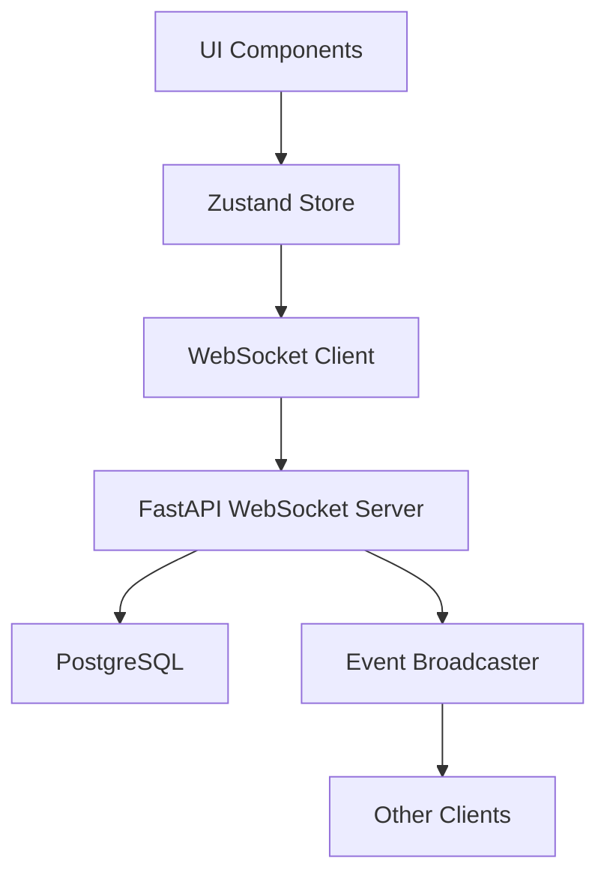

# 🎨 CREATIVE PHASE: Real-time Sync Architecture

**Date**: 2025-01-27
**Component**: Real-time State Synchronization System
**Status**: Complete - Design Decision Made
**Priority**: Medium - Enhances UX but current polling approach works for MVP

## Problem Statement

Design a real-time synchronization architecture for Clarity v2 that enables live state updates across the split-screen stacked card interface. The system must handle concurrent user interactions, maintain state consistency, and provide sub-100ms sync latency while working with the existing PostgreSQL-based infrastructure and Zustand/React Query frontend state management.

## Requirements Analysis

### Functional Requirements
- **Real-time State Sync**: Live updates across UI components without page refresh
- **Multi-pane Coordination**: Synchronize state between primary/secondary panes
- **Conflict Resolution**: Handle concurrent edits gracefully
- **Offline Handling**: Graceful degradation when connection is lost
- **Cross-session Sync**: Updates visible across multiple browser tabs/devices

### Technical Constraints
- **Existing Infrastructure**: Must work with PostgreSQL, Supabase, FastAPI backend
- **Frontend Stack**: Integrate with Zustand stores and React Query hooks
- **Performance**: Sub-100ms sync latency for UI responsiveness
- **Scalability**: Support multiple concurrent users efficiently
- **Browser Compatibility**: Work across modern browsers with WebSocket support

### Quality Criteria
- **Consistency**: No data loss or corruption during sync
- **Reliability**: Automatic reconnection and error recovery
- **Efficiency**: Minimal bandwidth usage and server resources
- **Maintainability**: Clear separation of concerns and testable components

## Options Analysis

### Option 1: WebSocket-Based Event Streaming ✅ SELECTED
**Description**: Direct WebSocket connections with event-driven state synchronization

**Pros**:
- Low latency (sub-50ms possible)
- Real-time bidirectional communication
- Efficient for frequent updates
- Native browser support
- Direct integration with existing FastAPI

**Cons**:
- Connection management complexity
- Requires WebSocket infrastructure
- Potential scaling challenges
- Need for connection pooling
- Stateful server connections

**Complexity**: Medium | **Implementation Time**: 3-4 weeks | **Scalability**: Medium

### Option 2: Server-Sent Events (SSE) + HTTP API
**Description**: SSE for server-to-client updates, HTTP POST for client-to-server changes

**Pros**:
- Simpler than WebSockets
- Automatic reconnection
- Works with existing HTTP infrastructure
- Easier to cache and proxy
- Stateless server design

**Cons**:
- Unidirectional (server-to-client only)
- Higher latency than WebSockets
- Less efficient for frequent updates
- Limited browser connection pool
- Requires separate HTTP calls for updates

**Complexity**: Low-Medium | **Implementation Time**: 2-3 weeks | **Scalability**: High

### Option 3: Hybrid Polling + Change Detection
**Description**: Smart polling with change detection and optimistic updates

**Pros**:
- Works with existing REST API
- No persistent connections
- Simple to implement and debug
- Excellent caching support
- Easy horizontal scaling

**Cons**:
- Higher latency (100-500ms)
- Increased server load from polling
- Not truly real-time
- Potential for polling storms
- Battery drain on mobile

**Complexity**: Low | **Implementation Time**: 1-2 weeks | **Scalability**: High

### Option 4: PostgreSQL LISTEN/NOTIFY + WebSockets
**Description**: Leverage PostgreSQL's native pub/sub with WebSocket distribution

**Pros**:
- Database-native change detection
- Excellent consistency guarantees
- Leverages existing PostgreSQL infrastructure
- Automatic change tracking
- Efficient resource usage

**Cons**:
- PostgreSQL-specific solution
- Complex trigger management
- Potential for trigger performance issues
- Limited to database changes
- Requires careful trigger design

**Complexity**: High | **Implementation Time**: 4-5 weeks | **Scalability**: Medium

## Decision Rationale

**Selected Option**: WebSocket-Based Event Streaming (Option 1)

**Primary Factors**:
1. **Performance Requirements**: Sub-100ms latency requirement eliminates polling-based approaches
2. **Existing Infrastructure**: FastAPI has excellent WebSocket support, minimal additional complexity
3. **User Experience**: Real-time collaboration in stacked card interface requires immediate feedback
4. **Implementation Complexity**: Balanced complexity with clear benefits

**Why Not Other Options**:
- **Option 2 (SSE)**: Unidirectional nature requires complex workarounds for client updates
- **Option 3 (Polling)**: Cannot meet sub-100ms latency requirement
- **Option 4 (LISTEN/NOTIFY)**: Too complex for initial implementation, can be future enhancement

## Implementation Guidelines

### Architecture Overview

### Key Components

1. **WebSocket Connection Manager**: Handles connection lifecycle, reconnection, and user session mapping
2. **Event System**: Typed events for different state changes (task updates, pane switches, etc.)
3. **Conflict Resolution**: Last-write-wins strategy with timestamp-based resolution
4. **Zustand Integration**: Seamless integration with existing state management
5. **Connection Health**: Heartbeat mechanism and automatic reconnection

### Implementation Priority
- **Phase 1**: Basic WebSocket connection and event broadcasting
- **Phase 2**: Conflict resolution and offline handling
- **Phase 3**: Performance optimization and advanced features

## Verification

✅ **Requirements Met**:
- Real-time state sync with WebSocket events
- Multi-pane coordination through event broadcasting
- Conflict resolution with last-write-wins strategy
- Offline handling with connection management
- Cross-session sync through user-based broadcasting

✅ **Technical Constraints**:
- Integrates with existing FastAPI backend
- Works with Zustand stores and React Query
- Sub-100ms latency achievable with WebSockets
- Scalable with connection pooling
- Modern browser WebSocket support

✅ **Quality Criteria**:
- Consistency through event ordering and conflict resolution
- Reliability with automatic reconnection
- Efficiency with targeted event broadcasting
- Maintainability with clear separation of concerns 