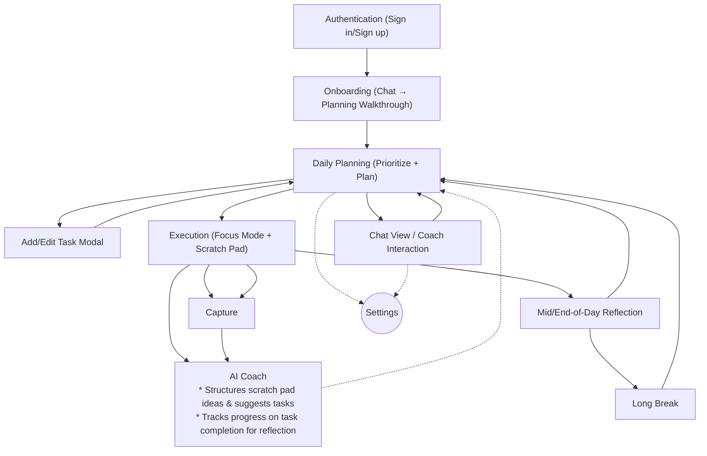

## Core User Journey: MVP Flow Overview

This assumes a solo user using the desktop web app to plan their day, execute tasks, and stay on track with AI support.
### 1. **Authentication & Entry**
- **Screens**: Sign in / Sign up (Google, Apple)
- **Outcome**: Land in “Planning” view, greeted by coach prompt

---
### **2. Onboarding Flow**
* **Planner View** _(light weekly grid or calendar optional in MVP)_
	- **Today View** – overview of today's tasks, sorted by time
    - **Add Task Modal** – quick capture + optional detail
    - **Chat View**
- **Flow**
	- User lands in chat view - AI assistant introduces itself and indicates to the user:
		- This app is different, and the assistant is there to help.
		- The app built around several key insights:
			- You can only do one thing at a time.
			- It's really hard for most people to keep track of *everything* they need to do.
			- Our world is designed to distract us from what matters most.
		- We'll go through a brief overview of the features and how to use the app.
	- Prompt user to click on Daily Planning View
		- Show user how to add tasks, edit tasks, & delete tasks.
		- Show user how to start a task.
			- When task starts, view switches to Focus & Execution.
	- Prompt user to start timer, begin countdown.
	- Prompt user to mark task as complete, triggering feedback animation.
		- Explain that's the execution flow.
	- Move user back to chat view.
		- AI assistant begins flow to either capture tasks from user via a brain dump or allow them to move to Daily Planning screen
### 2. **Daily Planning (Primary Flow)**
- **Screens**:
	- **Planner View** _(light weekly grid or calendar optional in MVP)_
	- **Today View** – overview of today's tasks, sorted by time
    - **Add Task Modal** – quick capture + optional detail
    - **Chat View**
- **Flow**:
    1. Land on Planner screen
    2. User adds tasks (quick-add or detailed)
    3. (Optional) AI suggests priorities or detects overdue tasks
    4. Tasks appear in time blocks (or user-defined groupings)
    5. User can click or drag to reorder tasks in time.
    6. Each task has a start arrow.
    7. User selects a task to begin by clicking start → launches Focus Mode

---

### 3. **Focus & Execution**
- **Screens**:
    - **Focus Mode** – single-task view with Pomodoro-style timer
    - **Scratch Pad** – toggleable overlay or side-panel
    - **Coach Suggestions** – lightweight nudges during idle/inactivity

- **Flow**:    
    1. User hits “Start” on a task
    2. Timer begins, UI minimizes distractions
    3. Scratch Pad and Pause available
    4. Task completion triggers feedback animation and asks how user felt.
    5. End of session without task completion triggers feedback animation 

---

### 4. **Reflection & Motivation**
- **Screens**:    
    - **Done List** – review of completed tasks
    - **Streak Tracker** – optional gamified element
    - **Mini Journal** _(optional for MVP)_
- **Flow**:
    1. User completes a task
    2. System logs streak/progress
    3. User sees “You’ve completed X today!” or optional positive message
    4. (Optional) Prompt user to reflect on what went well

---
### 5. **Supportive Features (Accessible from All Screens)**
- **Screens/Elements**:
    - Coach Panel (chat or prompt-style interaction)
    - Settings (theme, AI tone, account management)
    - Brain Dump Pad
    - Add Task (“+” FAB or keyboard shortcut)

---

## Navigation Bar
Navigation will be on the left hand side of the screen and have two elements:
* Daily planning: marked by a calendar icon
* Execution: marked by a checkbox icon
* Chat: marked by a chat icon
## 🗂️ Summary: Proposed MVP Screens

| Screen Name       | Purpose                                                                |
| ----------------- | ---------------------------------------------------------------------- |
| Sign In / Sign Up | Auth via Google/Apple                                                  |
| Today View        | Primary dashboard of daily tasks                                       |
| Add Task Modal    | Create new task with optional details                                  |
| Edit Task Modal   | Edit all details of a task. Options to delete, save, or mark complete. |
| Focus Mode        | Distraction-free task execution w/ timer                               |
| Coach Panel       | Contextual nudges or planning support                                  |
| Brain Dump Pad    | Externalize distracting thoughts                                       |
| Done List         | Motivation via completed-task log                                      |
| Settings          | Account, preferences, AI tone, integrations                            |
# Flow Diagram

