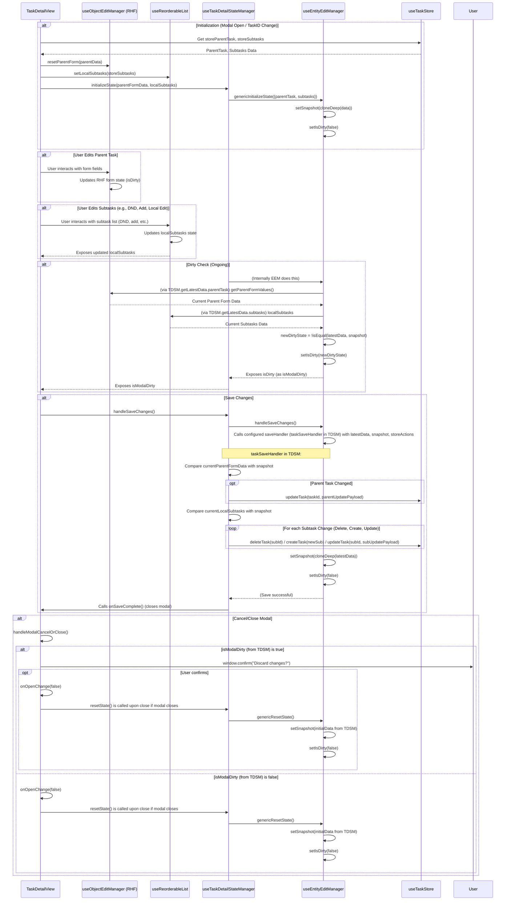

### Hook Interaction Summary:

*   **`TaskDetailView (TDV)`**: Orchestrator.
    *   Gets initial data from `useTaskStore`.
    *   Uses `useObjectEditManager (RHF_OEM)` for parent task form state.
    *   Uses `useReorderableList (RL)` for subtask list local state and DND.
    *   Uses `useTaskDetailStateManager (TDSM)` for overall dirty state, snapshotting, and save logic.
*   **`useObjectEditManager (RHF_OEM)`**: Manages React Hook Form state for the parent task. Returns form methods and RHF's `isDirty`.
*   **`useReorderableList (RL)`**: Manages the local list of subtasks, DND events, and local CRUD on that list.
*   **`useTaskDetailStateManager (TDSM)`**:
    *   Wraps `useEntityEditManager (EEM)`.
    *   Prepares composite data (`TaskDetailData` = parent + subtasks) for EEM.
    *   Defines `getLatestData` for EEM by fetching current parent form values from RHF_OEM and current subtasks from RL.
    *   Defines `taskSaveHandler` for EEM, which calculates deltas and calls `useTaskStore` actions for persistence.
*   **`useEntityEditManager (EEM)`**:
    *   Core generic logic for snapshotting, dirty checking (`isDataEqual`), and invoking a `saveHandler`.
    *   Manages `snapshot` and `isDirty` state.
*   **`useTaskStore (Store)`**: Zustand store, the single source of truth for task data and persistence to backend. Provides actions like `getTaskById`, `getSubtasksByParentId`, `updateTask`, `createTask`, `deleteTask`.

This setup aims for separation of concerns:
*   RHF for form details.
*   DND-kit for list reordering.
*   EEM for generic entity edit lifecycle (snapshot, dirty, save delegation).
*   TDSM to specialize EEM for the `TaskDetailData` structure and its specific save logic via `useTaskStore`.
*   TDV to integrate these hooks and manage the UI. 