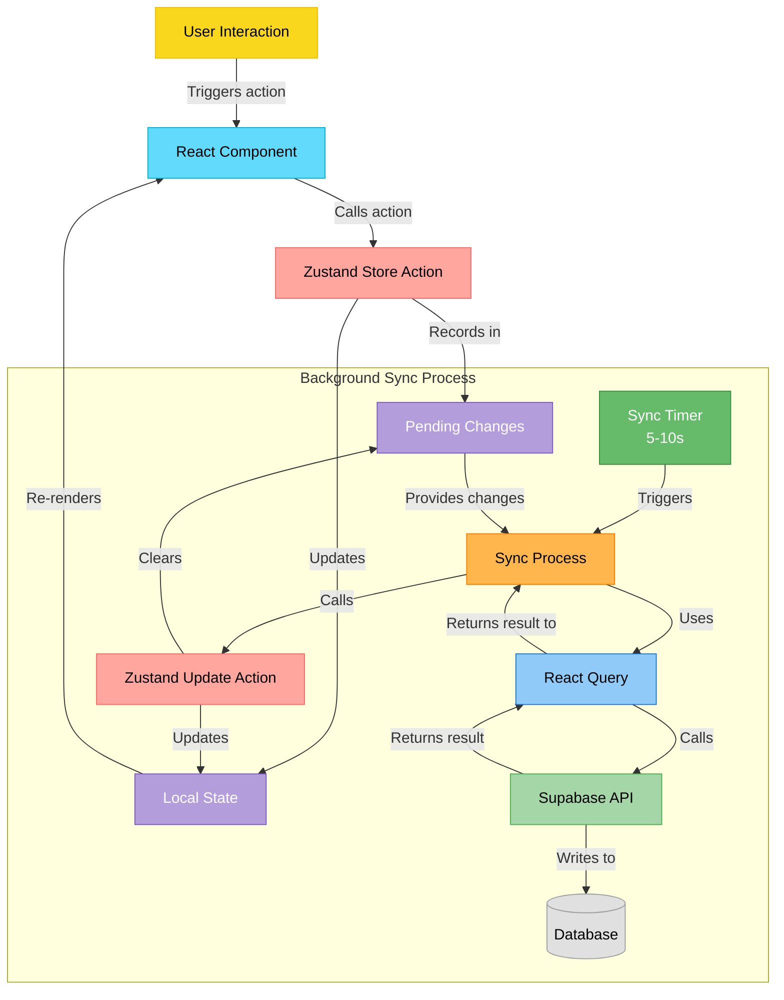
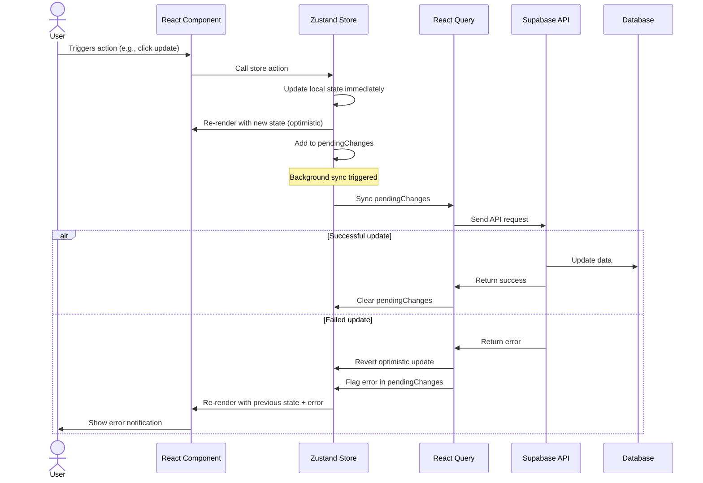
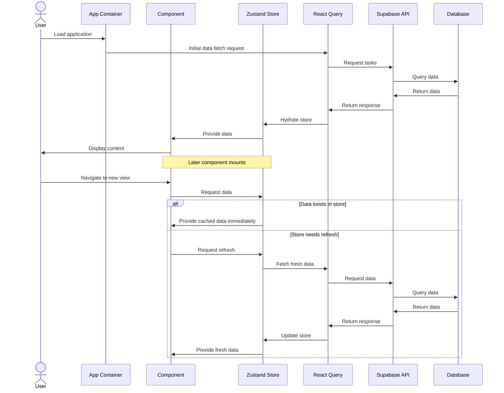
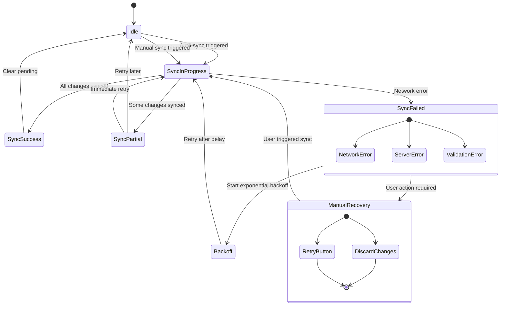

# State Management Architecture: Data Flow Diagrams

## Core Data Flow: UI to Database

## Optimistic Update & Rollback Flow

## Initial Data Loading & Hydration

## Sync Status & Error Recovery

