# 🎯 CLARITY V2 FINAL ARCHITECTURE - DUMB ROUTER + SHARED TYPING

**Date**: January 30, 2025  
**Status**: FINALIZED  
**Approach**: Dumb Router with Shared Type Foundation

## CORE ARCHITECTURE PRINCIPLE

**Simple Routing + Shared Types = Maximum Ergonomics**

- **Dumb Router**: `/chat` → Chat Gateway, everything else → Direct API
- **Shared Types**: Single source of truth for TypeScript + Pydantic
- **REST-like Tools**: Every tool = equivalent of a REST API call
- **Type Safety**: Zustand stores and API layer use identical types

## ARCHITECTURE DIAGRAM

```mermaid
graph TD
    subgraph "Frontend Layer"
        UI["UI Components<br>(Assistant-UI + Radix)"]
        State["Zustand Stores<br>(Strongly Typed)"]
        Hooks["Custom Hooks<br>(Typed Interfaces)"]
    end
    
    subgraph "Dumb Routing Layer"
        Router["Dumb Router<br>(/chat → Chat, /* → API)"]
        ChatGateway["Chat Gateway<br>(/chat)"]
        APIGateway["API Gateway<br>(/* routes)"]
    end
    
    subgraph "AI Processing Layer"
        AgentOrch["Agent Orchestrator"]
        ToolSystem["Tool System<br>(REST-like calls)"]
        LLMCore["LLM Core"]
    end
    
    subgraph "Direct API Layer"
        TaskAPI["Task API<br>(Strongly Typed)"]
        MemoryAPI["Memory API<br>(Strongly Typed)"]
        IntegrationAPI["Integration API<br>(Strongly Typed)"]
    end
    
    subgraph "Shared Foundation"
        SharedTypes["Shared Types<br>(TS + Pydantic)"]
        Database["Database<br>(PostgreSQL)"]
        ExternalAPIs["External APIs<br>(Gmail, etc.)"]
    end
    
    UI --> Hooks
    Hooks --> State
    Hooks --> Router
    
    Router -->|"/chat"| ChatGateway
    Router -->|"/*"| APIGateway
    
    ChatGateway --> AgentOrch
    AgentOrch --> ToolSystem
    ToolSystem --> TaskAPI
    ToolSystem --> MemoryAPI
    ToolSystem --> IntegrationAPI
    
    APIGateway --> TaskAPI
    APIGateway --> MemoryAPI
    APIGateway --> IntegrationAPI
    
    TaskAPI --> Database
    MemoryAPI --> Database
    IntegrationAPI --> ExternalAPIs
    
    State -.->|"Shared Types"| SharedTypes
    TaskAPI -.->|"Shared Types"| SharedTypes
    MemoryAPI -.->|"Shared Types"| SharedTypes
    IntegrationAPI -.->|"Shared Types"| SharedTypes
    
    style Router fill:#ff6b6b,stroke:#e55555,color:white
    style ChatGateway fill:#4ecdc4,stroke:#45b7aa,color:white
    style SharedTypes fill:#ffd93d,stroke:#ffcd02,color:black
    style ToolSystem fill:#96ceb4,stroke:#85c1a3,color:white
```



## KEY BENEFITS

### 1. **Dramatic Simplification**
- **Dumb Router**: No complex routing logic, just path-based delegation
- **Shared Types**: Single source of truth eliminates sync issues
- **REST-like Tools**: Every tool is just an API call equivalent
- **Clear Patterns**: Consistent interfaces throughout the system

### 2. **Type Safety Everywhere**
- **Frontend**: Zustand stores use exact same types as API
- **Backend**: Pydantic validation mirrors TypeScript definitions
- **Tools**: Use same request/response types as API endpoints
- **Automatic Sync**: TypeScript compiler ensures consistency

### 3. **Development Ergonomics**
- **Tool Development**: Create tool = create API endpoint
- **Testing**: Test tools by testing API endpoints
- **Documentation**: API docs automatically document tool capabilities
- **Debugging**: Tools behave exactly like direct API calls

## IMPLEMENTATION EXAMPLES

### Shared Type Foundation

```typescript
// shared/types/core.ts - Single source of truth
export interface Task {
  id: string;
  user_id: string;
  title: string;
  description?: string;
  status: 'pending' | 'in_progress' | 'completed' | 'cancelled';
  priority: 'low' | 'medium' | 'high' | 'urgent';
  due_date?: Date;
  created_at: Date;
  updated_at: Date;
}

export interface CreateTaskRequest {
  title: string;
  description?: string;
  status?: Task['status'];
  priority?: Task['priority'];
  due_date?: Date;
}
```

```python
# chatServer/types/core.py - Pydantic mirror
from typing import Optional, Literal
from pydantic import BaseModel
from datetime import datetime

class Task(BaseModel):
    id: str
    user_id: str
    title: str
    description: Optional[str] = None
    status: Literal['pending', 'in_progress', 'completed', 'cancelled']
    priority: Literal['low', 'medium', 'high', 'urgent']
    due_date: Optional[datetime] = None
    created_at: datetime
    updated_at: datetime

class CreateTaskRequest(BaseModel):
    title: str
    description: Optional[str] = None
    status: Optional[Literal['pending', 'in_progress', 'completed', 'cancelled']] = 'pending'
    priority: Optional[Literal['low', 'medium', 'high', 'urgent']] = 'medium'
    due_date: Optional[datetime] = None
```

### Dumb Router Implementation

```python
# chatServer/main.py - Simple routing
from fastapi import FastAPI
from .routers.chat import router as chat_router
from .routers.tasks import router as tasks_router

app = FastAPI(title="Clarity v2 API")

# Dumb routing - no complex logic
app.include_router(chat_router, prefix="/chat", tags=["chat"])
app.include_router(tasks_router, prefix="/api/tasks", tags=["tasks"])
```

### Direct API Layer

```python
# chatServer/routers/tasks.py - Strongly typed API
from fastapi import APIRouter, Depends
from typing import List
from ..types.core import Task, CreateTaskRequest
from ..services.task_service import TaskService
from ..dependencies.auth import get_current_user

router = APIRouter()

@router.post("/", response_model=Task)
async def create_task(
    request: CreateTaskRequest,
    user_id: str = Depends(get_current_user)
) -> Task:
    return await TaskService.create_task(user_id, request)

@router.get("/", response_model=List[Task])
async def get_tasks(
    user_id: str = Depends(get_current_user)
) -> List[Task]:
    return await TaskService.get_tasks(user_id)
```

### Zustand Store (Shared Types)

```typescript
// stores/taskStore.ts - Uses shared types
import { create } from 'zustand';
import { Task, CreateTaskRequest } from '../types/core';
import { taskAPI } from '../api/taskAPI';

interface TaskStore {
  tasks: Task[];
  isLoading: boolean;
  
  createTask: (request: CreateTaskRequest) => Promise<Task>;
  getTasks: () => Promise<Task[]>;
}

export const useTaskStore = create<TaskStore>((set, get) => ({
  tasks: [],
  isLoading: false,
  
  createTask: async (request: CreateTaskRequest) => {
    const task = await taskAPI.createTask(request);
    set(state => ({ tasks: [...state.tasks, task] }));
    return task;
  },
  
  getTasks: async () => {
    const tasks = await taskAPI.getTasks();
    set({ tasks });
    return tasks;
  }
}));
```

### REST-like Tool System

```python
# chatServer/tools/task_tools.py - Tool = API call
from ..types.core import CreateTaskRequest
from ..services.task_service import TaskService

class CreateTaskTool:
    """Tool that creates a task - equivalent to POST /api/tasks"""
    
    def __init__(self, user_id: str):
        self.user_id = user_id
    
    async def execute(self, **kwargs):
        # Use same types and service as API endpoint
        request = CreateTaskRequest(**kwargs)
        task = await TaskService.create_task(self.user_id, request)
        
        return {
            "success": True,
            "data": task.dict(),
            "message": f"Created task: {task.title}"
        }
```

## MIGRATION PHASES

### Phase 1: Type Foundation (Week 1)
1. Create shared TypeScript/Pydantic type definitions
2. Implement dumb router with basic path routing
3. Convert one API endpoint (tasks) to new pattern

### Phase 2: Tool System (Week 2)
1. Convert existing tools to REST-like pattern
2. Implement chat gateway with tool orchestration
3. Test tool/API equivalence

### Phase 3: Frontend Integration (Week 3)
1. Implement Zustand stores using shared types
2. Create typed API client layer
3. Build chat interface with Assistant-UI

### Phase 4: Complete Migration (Week 4)
1. Migrate all remaining endpoints and tools
2. Implement caching and optimization
3. Performance testing and refinement

## SUCCESS METRICS

- **Type Safety**: 100% shared types between frontend/backend
- **Tool Simplicity**: Every tool maps 1:1 to API endpoint
- **Development Speed**: New features require only API + tool creation
- **Testing Coverage**: Tools tested via API endpoint tests
- **Performance**: Database out of hot path via Zustand caching

## NEXT STEPS

1. **Start with Types**: Create shared type definitions
2. **Implement Dumb Router**: Basic FastAPI routing setup
3. **Convert One Endpoint**: Tasks API as proof of concept
4. **Build First Tool**: CreateTaskTool using new pattern
5. **Test Integration**: Verify tool/API equivalence

This architecture preserves all intentional choices (Assistant-UI, Radix, Zustand) while dramatically simplifying development patterns and ensuring type safety throughout the system. 