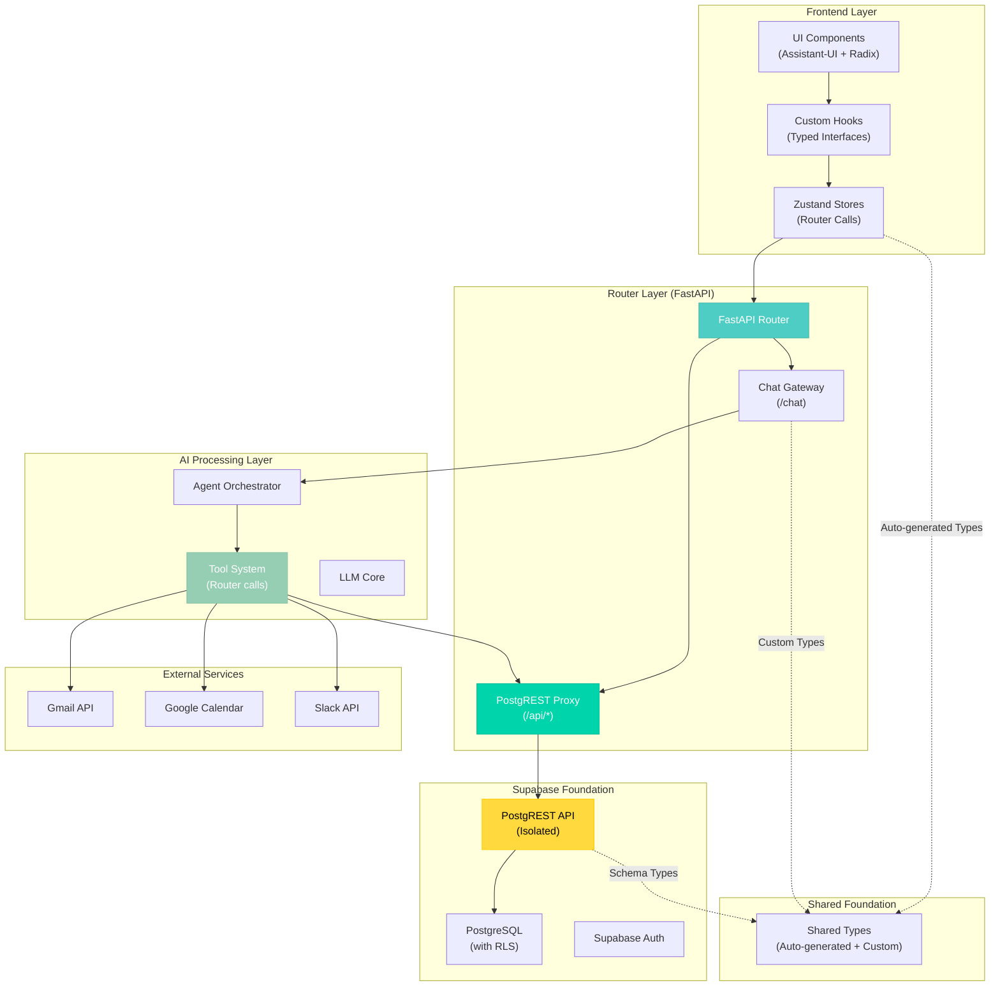

# 🎯 CLARITY V2 POSTGREST ARCHITECTURE - MAXIMUM SIMPLIFICATION

**Date**: January 30, 2025  
**Status**: FINALIZED  
**Approach**: PostgREST + Minimal Chat Gateway

## CORE PRINCIPLE

**Router-Proxied PostgREST + Minimal Chat Gateway = Maximum Simplification with Database Isolation**

- **Eliminate Custom API**: Use router-proxied PostgREST for all data operations
- **Database Isolation**: No direct frontend access to database
- **Consistent Typing**: Auto-generated types + custom chat types
- **Controlled DB Access**: Rate limiting and caching built into stores
- **Minimal Backend**: Router with PostgREST proxy + chat gateway for AI orchestration

## ARCHITECTURE DIAGRAM



## DETAILED FILE STRUCTURE

### Frontend Structure (webApp/)
```
webApp/
├── src/
│   ├── components/           # UI Components (Assistant-UI + Radix)
│   │   ├── chat/            # Chat interface components
│   │   │   ├── ChatWindow.tsx
│   │   │   ├── MessageList.tsx
│   │   │   └── MessageInput.tsx
│   │   ├── tasks/           # Task management components
│   │   │   ├── TaskList.tsx
│   │   │   ├── TaskItem.tsx
│   │   │   └── CreateTaskForm.tsx
│   │   ├── memory/          # Memory/notes components
│   │   │   ├── MemoryList.tsx
│   │   │   └── MemoryEditor.tsx
│   │   └── ui/              # Shared UI components (Radix)
│   │       ├── Button.tsx
│   │       ├── Input.tsx
│   │       └── Dialog.tsx
│   ├── stores/              # Zustand stores (router calls)
│   │   ├── chatStore.ts     # Chat state and AI interactions
│   │   ├── taskStore.ts     # Task management (router-proxied)
│   │   ├── memoryStore.ts   # Memory/notes (router-proxied)
│   │   └── authStore.ts     # Authentication (Supabase Auth)
│   ├── hooks/               # Custom hooks (typed interfaces)
│   │   ├── useChat.ts       # Chat and AI interactions
│   │   ├── useTasks.ts      # Task operations (router)
│   │   ├── useMemory.ts     # Memory operations (router)
│   │   └── useAuth.ts       # Authentication hooks
│   ├── lib/                 # Core libraries
│   │   ├── apiClient.ts     # Router API client
│   │   └── chatAPI.ts       # Chat gateway client
│   └── types/               # TypeScript type definitions
│       ├── database.ts      # Auto-generated from Supabase
│       ├── chat.ts          # Chat-specific types
│       └── shared.ts        # Shared custom types
├── package.json
└── tsconfig.json
```

### Backend Structure (chatServer/) - Router + Chat Gateway
```
chatServer/
├── main.py                  # FastAPI router with PostgREST proxy + chat gateway
├── routers/
│   ├── chat.py             # Chat endpoint
│   └── data.py             # PostgREST proxy endpoints
├── ai/                     # AI Integration Hub
│   ├── __init__.py
│   ├── agent_orchestrator.py # Agent lifecycle management
│   ├── tool_registry.py    # Tool registration (router-based)
│   └── tool_executor.py    # Tool execution engine
├── tools/                  # Tool implementations (router calls)
│   ├── __init__.py
│   ├── base_tool.py        # Base tool interface
│   ├── task_tools.py       # Task-related tools (router-proxied)
│   ├── memory_tools.py     # Memory-related tools (router-proxied)
│   └── integration_tools.py # External API tools (Gmail, etc.)
├── types/                  # Pydantic type definitions
│   ├── __init__.py
│   ├── chat.py             # Chat request/response types
│   └── shared.py           # Shared types for tools
├── config/
│   ├── __init__.py
│   └── settings.py         # Configuration (Supabase, API keys)
├── dependencies/
│   ├── __init__.py
│   ├── auth.py             # Supabase auth integration
│   └── postgrest.py       # PostgREST client setup
├── requirements.txt
└── pyproject.toml
```

## IMPLEMENTATION EXAMPLES

### 1. Auto-Generated Database Types

```typescript
// types/database.ts - Auto-generated from Supabase CLI
export interface Database {
  public: {
    Tables: {
      tasks: {
        Row: {
          id: string;
          user_id: string;
          title: string;
          description: string | null;
          status: 'pending' | 'in_progress' | 'completed' | 'cancelled';
          priority: 'low' | 'medium' | 'high' | 'urgent';
          due_date: string | null;
          created_at: string;
          updated_at: string;
        };
        Insert: {
          id?: string;
          user_id: string;
          title: string;
          description?: string | null;
          status?: 'pending' | 'in_progress' | 'completed' | 'cancelled';
          priority?: 'low' | 'medium' | 'high' | 'urgent';
          due_date?: string | null;
        };
        Update: {
          title?: string;
          description?: string | null;
          status?: 'pending' | 'in_progress' | 'completed' | 'cancelled';
          priority?: 'low' | 'medium' | 'high' | 'urgent';
          due_date?: string | null;
        };
      };
      memories: {
        Row: {
          id: string;
          user_id: string;
          content: string;
          tags: string[];
          context: Json | null;
          created_at: string;
          updated_at: string;
        };
        Insert: {
          id?: string;
          user_id: string;
          content: string;
          tags?: string[];
          context?: Json | null;
        };
        Update: {
          content?: string;
          tags?: string[];
          context?: Json | null;
        };
      };
    };
  };
}

// Convenience type exports
export type Task = Database['public']['Tables']['tasks']['Row'];
export type CreateTaskRequest = Database['public']['Tables']['tasks']['Insert'];
export type UpdateTaskRequest = Database['public']['Tables']['tasks']['Update'];
export type Memory = Database['public']['Tables']['memories']['Row'];
export type CreateMemoryRequest = Database['public']['Tables']['memories']['Insert'];
```

### 2. Router API Client

```typescript
// lib/apiClient.ts - Router API client for PostgREST proxy
const API_BASE_URL = process.env.NEXT_PUBLIC_API_URL || 'http://localhost:8000';

class APIClient {
  private baseURL: string;

  constructor(baseURL: string = API_BASE_URL) {
    this.baseURL = baseURL;
  }

  async request<T>(endpoint: string, options: RequestInit = {}): Promise<T> {
    const url = `${this.baseURL}${endpoint}`;
    
    const response = await fetch(url, {
      headers: {
        'Content-Type': 'application/json',
        'x-client-info': 'clarity-v2-frontend',
        ...options.headers,
      },
      ...options,
    });

    if (!response.ok) {
      throw new Error(`API request failed: ${response.statusText}`);
    }

    return response.json();
  }

  // PostgREST-style query methods
  async select<T>(table: string, query: string = ''): Promise<T[]> {
    return this.request<T[]>(`/api/${table}?${query}`);
  }

  async insert<T>(table: string, data: any): Promise<T> {
    return this.request<T>(`/api/${table}`, {
      method: 'POST',
      body: JSON.stringify(data),
    });
  }

  async update<T>(table: string, id: string, data: any): Promise<T> {
    return this.request<T>(`/api/${table}?id=eq.${id}`, {
      method: 'PATCH',
      body: JSON.stringify(data),
    });
  }

  async delete(table: string, id: string): Promise<void> {
    await this.request(`/api/${table}?id=eq.${id}`, {
      method: 'DELETE',
    });
  }
}

export const apiClient = new APIClient();
```

### 3. Zustand Store with Router-Based Access

```typescript
// stores/taskStore.ts - Router-based integration with controlled calls
import { create } from 'zustand';
import { apiClient } from '../lib/apiClient';
import type { Task, CreateTaskRequest, UpdateTaskRequest } from '../types/database';

interface TaskStore {
  tasks: Task[];
  isLoading: boolean;
  error: string | null;
  lastFetch: Date | null;
  
  // Controlled DB operations via router
  createTask: (request: CreateTaskRequest) => Promise<Task>;
  getTasks: (forceRefresh?: boolean) => Promise<Task[]>;
  updateTask: (id: string, request: UpdateTaskRequest) => Promise<Task>;
  deleteTask: (id: string) => Promise<void>;
  
  // Periodic polling management
  startPolling: () => void;
  stopPolling: () => void;
  
  // Cache management
  clearCache: () => void;
  isStale: () => boolean;
}

export const useTaskStore = create<TaskStore>((set, get) => {
  let pollingInterval: NodeJS.Timeout | null = null;

  return {
    tasks: [],
    isLoading: false,
    error: null,
    lastFetch: null,
    
    createTask: async (request: CreateTaskRequest) => {
      set({ isLoading: true, error: null });
      
      try {
        const data = await apiClient.insert<Task>('tasks', request);
        
        // Optimistic update
        set(state => ({ 
          tasks: [...state.tasks, data],
          isLoading: false 
        }));
        
        return data;
      } catch (error) {
        set({ error: error.message, isLoading: false });
        throw error;
      }
    },
    
    getTasks: async (forceRefresh = false) => {
      const { lastFetch, isStale } = get();
      
      // Controlled fetching - avoid unnecessary calls
      if (!forceRefresh && lastFetch && !isStale()) {
        return get().tasks;
      }
      
      set({ isLoading: true, error: null });
      
      try {
        const data = await apiClient.select<Task>('tasks', 'order=created_at.desc&limit=100');
        
        set({ 
          tasks: data, 
          isLoading: false,
          lastFetch: new Date()
        });
        
        return data;
      } catch (error) {
        set({ error: error.message, isLoading: false });
        throw error;
      }
    },
    
    startPolling: () => {
      if (pollingInterval) return;
      
      pollingInterval = setInterval(() => {
        get().getTasks(true);
      }, 30000); // Poll every 30 seconds
    },
    
    stopPolling: () => {
      if (pollingInterval) {
        clearInterval(pollingInterval);
        pollingInterval = null;
      }
    },
    
    clearCache: () => set({ tasks: [], lastFetch: null }),
    
    isStale: () => {
      const { lastFetch } = get();
      if (!lastFetch) return true;
      
      // Consider data stale after 5 minutes
      const fiveMinutesAgo = new Date(Date.now() - 5 * 60 * 1000);
      return lastFetch < fiveMinutesAgo;
    }
  };
});
```

### 4. FastAPI Router with PostgREST Proxy

```python
# main.py - FastAPI router with PostgREST proxy + chat gateway
from fastapi import FastAPI
from fastapi.middleware.cors import CORSMiddleware
from .routers.chat import router as chat_router
from .routers.data import router as data_router
from .config.settings import settings

app = FastAPI(
    title="Clarity v2 Router",
    description="Router with PostgREST proxy + AI chat gateway for Clarity v2",
    version="1.0.0"
)

# CORS for frontend
app.add_middleware(
    CORSMiddleware,
    allow_origins=settings.ALLOWED_ORIGINS,
    allow_credentials=True,
    allow_methods=["*"],
    allow_headers=["*"],
)

# Chat gateway for AI
app.include_router(chat_router, prefix="/chat", tags=["chat"])

# PostgREST proxy for data operations
app.include_router(data_router, prefix="/api", tags=["data"])

@app.get("/health")
async def health():
    return {
        "status": "healthy", 
        "service": "clarity-v2-router",
        "postgrest_url": settings.POSTGREST_URL
    }
```

### 5. PostgREST Proxy Router

```python
# routers/data.py - PostgREST proxy with validation
from fastapi import APIRouter, Request, HTTPException
from fastapi.responses import Response
import httpx
from ..config.settings import settings

router = APIRouter()

@router.api_route("/{table:path}", methods=["GET", "POST", "PATCH", "DELETE"])
async def postgrest_proxy(table: str, request: Request):
    """Proxy all data requests to PostgREST with validation and rate limiting"""
    
    # Basic validation
    if not table.replace('/', '').replace('_', '').isalnum():
        raise HTTPException(status_code=400, detail="Invalid table name")
    
    # Construct PostgREST URL
    postgrest_url = f"{settings.POSTGREST_URL}/{table}"
    
    # Forward query parameters
    query_params = str(request.url.query)
    if query_params:
        postgrest_url += f"?{query_params}"
    
    # Prepare headers
    headers = {
        "Authorization": f"Bearer {settings.POSTGREST_JWT_SECRET}",
        "Content-Type": "application/json",
        "Prefer": "return=representation"
    }
    
    try:
        async with httpx.AsyncClient() as client:
            # Forward request to PostgREST
            if request.method == "GET":
                response = await client.get(postgrest_url, headers=headers)
            elif request.method == "POST":
                body = await request.body()
                response = await client.post(postgrest_url, headers=headers, content=body)
            elif request.method == "PATCH":
                body = await request.body()
                response = await client.patch(postgrest_url, headers=headers, content=body)
            elif request.method == "DELETE":
                response = await client.delete(postgrest_url, headers=headers)
            
            # Return PostgREST response
            return Response(
                content=response.content,
                status_code=response.status_code,
                headers=dict(response.headers)
            )
            
    except httpx.RequestError as e:
        raise HTTPException(status_code=503, detail=f"PostgREST unavailable: {str(e)}")
```

### 6. Router-Based Tools

```python
# tools/task_tools.py - Tools make router-proxied calls
import httpx
from typing import Dict, Any
from ..config.settings import settings
from ..types.chat import AgentAction

class CreateTaskTool:
    """Tool that creates a task via router → PostgREST"""
    
    name = "create_task"
    description = "Create a new task for the user"
    
    def __init__(self, user_id: str):
        self.user_id = user_id
        self.client = httpx.AsyncClient(
            base_url=settings.ROUTER_BASE_URL,
            headers={
                "Content-Type": "application/json",
                "x-client-info": "clarity-v2-tools"
            }
        )
    
    async def execute(self, **kwargs) -> Dict[str, Any]:
        """Execute tool - router-proxied PostgREST call"""
        try:
            # Prepare task data
            task_data = {
                "user_id": self.user_id,
                "title": kwargs["title"],
                "description": kwargs.get("description"),
                "status": kwargs.get("status", "pending"),
                "priority": kwargs.get("priority", "medium"),
                "due_date": kwargs.get("due_date")
            }
            
            # Remove None values
            task_data = {k: v for k, v in task_data.items() if v is not None}
            
            # Router-proxied PostgREST call
            response = await self.client.post("/api/tasks", json=task_data)
            
            if response.status_code == 201:
                task = response.json()
                return {
                    "success": True,
                    "data": task,
                    "message": f"Created task: {task['title']}",
                    "action": AgentAction(
                        type="task_created",
                        data=task,
                        status="completed"
                    ).dict()
                }
            else:
                return {
                    "success": False,
                    "error": response.text,
                    "message": "Failed to create task"
                }
                
        except Exception as e:
            return {
                "success": False,
                "error": str(e),
                "message": "Failed to create task due to system error"
            }
    
    async def __aenter__(self):
        return self
    
    async def __aexit__(self, exc_type, exc_val, exc_tb):
        await self.client.aclose()
```

## SIMPLE IMPLEMENTATION PLAN

### Phase 0: Create New File Structure (Day 1)
```bash
# Create new directory structure
mkdir -p webApp/src/{components/{chat,tasks,memory,ui},stores,hooks,lib,types}
mkdir -p chatServer/{routers,ai,tools,types,config,dependencies}

# Set up Supabase type generation
npx supabase gen types typescript --project-id YOUR_PROJECT_ID > webApp/src/types/database.ts
```

### Phase 1: Build Router with PostgREST Proxy (Day 2)
- [ ] Create FastAPI router with dual routing: `/chat` and `/api/*`
- [ ] Implement PostgREST proxy for `/api/*` routes
- [ ] Configure CORS and basic middleware
- [ ] Health check endpoint
- [ ] Test routing: `/chat` → AI gateway, `/api/*` → PostgREST proxy

### Phase 2: Create Types (Day 3)
- [ ] Generate TypeScript types from Supabase schema
- [ ] Create custom chat types (TypeScript + Pydantic)
- [ ] Validate type consistency
- [ ] Set up type generation script

### Phase 3: Migrate Frontend to Router (Day 4-5)
- [ ] Convert taskStore to router-proxied calls
- [ ] Implement controlled DB access patterns
- [ ] Add periodic polling for data updates
- [ ] Test frontend-to-router-to-database flow

### Phase 4: Migrate Tools to Router (Day 6-7)
- [ ] Convert CreateTaskTool to router-proxied calls
- [ ] Convert GetTasksTool to router-proxied calls
- [ ] Implement chat gateway integration
- [ ] Test AI-to-router-to-database flow

### Phase 5: Delete Everything Else (Day 8)
- [ ] Delete chatServer/services/
- [ ] Delete chatServer/models/
- [ ] Clean up dependencies
- [ ] Validate complete system

## SUCCESS METRICS

- **Code Reduction**: Eliminate 80%+ of custom backend code
- **Type Safety**: 100% shared types via auto-generation
- **DB Control**: All queries have limits and caching
- **Data Updates**: Efficient periodic polling without WebSocket complexity
- **Tool Simplicity**: Every tool = router → PostgREST HTTP call
- **Development Speed**: New features = database change + tool

## BENEFITS

### 1. **Massive Simplification with Security**
- **No Custom API Layer**: Router-proxied PostgREST handles all data operations
- **Database Isolation**: No direct frontend access to database
- **Auto-Generated Types**: Database schema drives TypeScript types
- **Minimal Backend**: Router with PostgREST proxy + chat gateway

### 2. **Controlled DB Access**
- **Rate Limiting**: Built into router layer
- **Request Validation**: Router validates all requests before proxying
- **Caching**: Intelligent caching in Zustand stores
- **Query Limits**: Automatic limits on all queries

### 3. **Development Ergonomics**
- **Tool Development**: Tool = router → PostgREST HTTP call
- **Type Safety**: Compiler-enforced consistency
- **Data Updates**: Efficient polling with intelligent cache management
- **Testing**: All operations are HTTP requests that can be easily tested

This architecture eliminates the custom API layer entirely while maintaining full control over database access patterns, ensuring security through database isolation, and preserving all intentional architectural choices.