# 🎨🎨🎨 CREATIVE PHASE: CLARITY V2 SYSTEM ARCHITECTURE 🎨🎨🎨

**Date**: January 30, 2025  
**Phase**: Architecture Design  
**Scope**: Complete system architecture for Clarity v2 with AI-driven flows and tools

## PROBLEM STATEMENT

Design a comprehensive system architecture for Clarity v2 that:

1. **Preserves Intentional Choices**: Assistant-UI, Radix UI, Zustand for state management
2. **Establishes Clear Patterns**: Standardized patterns for consistent development
3. **Defines Simple Interfaces**: Clear, typed interfaces for all system capabilities
4. **Leverages Heavy Typing**: TypeScript/Pydantic throughout to prevent bloat
5. **Integrates AI Infrastructure**: Chat endpoints, agent orchestration, and tool systems
6. **Maintains Performance**: Database out of hot path, efficient tool execution

The system must support both traditional API-based operations AND AI-driven flows accessible via `/chat` endpoint, with tools that can call other APIs to function.

## CURRENT STATE ANALYSIS

### Existing AI Infrastructure (Strengths)
- **Database-Driven Agent Loading**: `agent_loader_db.py` provides flexible agent configuration
- **Dynamic Tool System**: `CRUDTool` with runtime schema generation for flexible database operations
- **Specialized Tools**: `EmailDigestTool`, `GmailTools` with OAuth integration
- **Service Layer**: Vault token management, background tasks, caching infrastructure

### Current Complexity Issues
- **Dual Import Patterns**: Every file has try/except import blocks
- **Over-Engineered Services**: 397-line VaultTokenService, 283-line BackgroundTaskService
- **Complex Tool Registration**: Multiple registries and dynamic class creation
- **Mixed Patterns**: Some tools use classes, others use functions

## SELECTED ARCHITECTURE: DUMB ROUTER WITH SHARED TYPING

**Selected Option**: **Hybrid Architecture with Dumb Routing**

### Core Principle: Simple Routing + Shared Types

```mermaid
graph TD
    subgraph "Frontend Layer"
        UI["UI Components<br>(Assistant-UI + Radix)"]
        State["Zustand Stores<br>(Strongly Typed)"]
        Hooks["Custom Hooks<br>(Typed Interfaces)"]
    end
    
    subgraph "Dumb Routing Layer"
        Router["Dumb Router<br>(/chat → Chat, /* → API)"]
        ChatGateway["Chat Gateway<br>(/chat)"]
        APIGateway["API Gateway<br>(/* routes)"]
    end
    
    subgraph "AI Processing Layer"
        AgentOrch["Agent Orchestrator"]
        ToolSystem["Tool System<br>(REST-like calls)"]
        LLMCore["LLM Core"]
    end
    
    subgraph "Direct API Layer"
        TaskAPI["Task API<br>(Strongly Typed)"]
        MemoryAPI["Memory API<br>(Strongly Typed)"]
        IntegrationAPI["Integration API<br>(Strongly Typed)"]
    end
    
    subgraph "Shared Foundation"
        SharedTypes["Shared Types<br>(TS + Pydantic)"]
        Database["Database<br>(PostgreSQL)"]
        ExternalAPIs["External APIs<br>(Gmail, etc.)"]
    end
    
    UI --> Hooks
    Hooks --> State
    Hooks --> Router
    
    Router -->|"/chat"| ChatGateway
    Router -->|"/*"| APIGateway
    
    ChatGateway --> AgentOrch
    AgentOrch --> ToolSystem
    ToolSystem --> TaskAPI
    ToolSystem --> MemoryAPI
    ToolSystem --> IntegrationAPI
    
    APIGateway --> TaskAPI
    APIGateway --> MemoryAPI
    APIGateway --> IntegrationAPI
    
    TaskAPI --> Database
    MemoryAPI --> Database
    IntegrationAPI --> ExternalAPIs
    
    State -.->|"Shared Types"| SharedTypes
    TaskAPI -.->|"Shared Types"| SharedTypes
    MemoryAPI -.->|"Shared Types"| SharedTypes
    IntegrationAPI -.->|"Shared Types"| SharedTypes
    
    style Router fill:#ff6b6b,stroke:#e55555,color:white
    style ChatGateway fill:#4ecdc4,stroke:#45b7aa,color:white
    style SharedTypes fill:#ffd93d,stroke:#ffcd02,color:black
    style ToolSystem fill:#96ceb4,stroke:#85c1a3,color:white
```



### Key Architecture Benefits

1. **Dumb Router Simplicity**: 
   - `/chat` → Chat Gateway (AI processing)
   - Everything else → API Gateway (direct access)
   - No complex routing logic or decision trees

2. **Shared Type Foundation**:
   - Single source of truth for all data structures
   - Zustand stores and API layer use identical types
   - Automatic synchronization through TypeScript compiler
   - Pydantic mirrors for backend validation

3. **REST-like Tool System**:
   - Every tool is equivalent to a REST API call
   - Tools call Direct API layer using same interfaces as frontend
   - Simplified tool development and testing
   - Clear separation between AI orchestration and data operations

## DETAILED IMPLEMENTATION DESIGN

### 1. Shared Type System Foundation

```typescript
// shared/types/core.ts - Single source of truth
export interface User {
  id: string;
  email: string;
  profile: UserProfile;
  created_at: Date;
  updated_at: Date;
}

export interface Task {
  id: string;
  user_id: string;
  title: string;
  description?: string;
  status: 'pending' | 'in_progress' | 'completed' | 'cancelled';
  priority: 'low' | 'medium' | 'high' | 'urgent';
  due_date?: Date;
  created_at: Date;
  updated_at: Date;
}

export interface CreateTaskRequest {
  title: string;
  description?: string;
  status?: Task['status'];
  priority?: Task['priority'];
  due_date?: Date;
}

export interface UpdateTaskRequest {
  title?: string;
  description?: string;
  status?: Task['status'];
  priority?: Task['priority'];
  due_date?: Date;
}

export interface Memory {
  id: string;
  user_id: string;
  content: string;
  tags: string[];
  context?: Record<string, any>;
  created_at: Date;
  updated_at: Date;
}

export interface ChatMessage {
  id: string;
  content: string;
  role: 'user' | 'assistant' | 'system';
  timestamp: Date;
  metadata?: ChatMetadata;
}

export interface ChatRequest {
  message: string;
  context?: ChatContext;
  tools?: string[];
}

export interface ChatResponse {
  message: string;
  actions?: AgentAction[];
  context?: ChatContext;
  error?: string;
}
```

```python
# chatServer/types/core.py - Pydantic mirrors
from typing import List, Optional, Dict, Any, Literal
from pydantic import BaseModel, Field
from datetime import datetime

class User(BaseModel):
    id: str
    email: str
    profile: Dict[str, Any]
    created_at: datetime
    updated_at: datetime

class Task(BaseModel):
    id: str
    user_id: str
    title: str
    description: Optional[str] = None
    status: Literal['pending', 'in_progress', 'completed', 'cancelled']
    priority: Literal['low', 'medium', 'high', 'urgent']
    due_date: Optional[datetime] = None
    created_at: datetime
    updated_at: datetime

class CreateTaskRequest(BaseModel):
    title: str
    description: Optional[str] = None
    status: Optional[Literal['pending', 'in_progress', 'completed', 'cancelled']] = 'pending'
    priority: Optional[Literal['low', 'medium', 'high', 'urgent']] = 'medium'
    due_date: Optional[datetime] = None

class UpdateTaskRequest(BaseModel):
    title: Optional[str] = None
    description: Optional[str] = None
    status: Optional[Literal['pending', 'in_progress', 'completed', 'cancelled']] = None
    priority: Optional[Literal['low', 'medium', 'high', 'urgent']] = None
    due_date: Optional[datetime] = None

class Memory(BaseModel):
    id: str
    user_id: str
    content: str
    tags: List[str]
    context: Optional[Dict[str, Any]] = None
    created_at: datetime
    updated_at: datetime

class ChatRequest(BaseModel):
    message: str
    context: Optional[Dict[str, Any]] = None
    tools: Optional[List[str]] = None
    user_id: str
    session_id: str

class ChatResponse(BaseModel):
    message: str
    actions: Optional[List[Dict[str, Any]]] = None
    context: Optional[Dict[str, Any]] = None
    error: Optional[str] = None
```

### 2. Dumb Router Implementation

```python
# chatServer/main.py - Simple routing
from fastapi import FastAPI, Request
from fastapi.routing import APIRoute
from .routers.chat import router as chat_router
from .routers.tasks import router as tasks_router
from .routers.memory import router as memory_router
from .routers.auth import router as auth_router

app = FastAPI(title="Clarity v2 API")

# Dumb routing - no complex logic
app.include_router(chat_router, prefix="/chat", tags=["chat"])
app.include_router(tasks_router, prefix="/api/tasks", tags=["tasks"])
app.include_router(memory_router, prefix="/api/memory", tags=["memory"])
app.include_router(auth_router, prefix="/api/auth", tags=["auth"])

@app.get("/")
async def root():
    return {"message": "Clarity v2 API", "version": "1.0.0"}
```

### 3. Direct API Layer (Strongly Typed)

```python
# chatServer/routers/tasks.py
from fastapi import APIRouter, Depends, HTTPException
from typing import List, Optional
from ..types.core import Task, CreateTaskRequest, UpdateTaskRequest
from ..services.task_service import TaskService
from ..dependencies.auth import get_current_user

router = APIRouter()

@router.post("/", response_model=Task)
async def create_task(
    request: CreateTaskRequest,
    user_id: str = Depends(get_current_user)
) -> Task:
    """Create a new task."""
    return await TaskService.create_task(user_id, request)

@router.get("/", response_model=List[Task])
async def get_tasks(
    status: Optional[str] = None,
    priority: Optional[str] = None,
    user_id: str = Depends(get_current_user)
) -> List[Task]:
    """Get tasks with optional filters."""
    filters = {}
    if status:
        filters['status'] = status
    if priority:
        filters['priority'] = priority
    
    return await TaskService.get_tasks(user_id, filters)

@router.get("/{task_id}", response_model=Task)
async def get_task(
    task_id: str,
    user_id: str = Depends(get_current_user)
) -> Task:
    """Get a specific task."""
    task = await TaskService.get_task(user_id, task_id)
    if not task:
        raise HTTPException(status_code=404, detail="Task not found")
    return task

@router.put("/{task_id}", response_model=Task)
async def update_task(
    task_id: str,
    request: UpdateTaskRequest,
    user_id: str = Depends(get_current_user)
) -> Task:
    """Update a task."""
    return await TaskService.update_task(user_id, task_id, request)

@router.delete("/{task_id}")
async def delete_task(
    task_id: str,
    user_id: str = Depends(get_current_user)
):
    """Delete a task."""
    await TaskService.delete_task(user_id, task_id)
    return {"message": "Task deleted successfully"}
```

### 4. Zustand Stores (Shared Types)

```typescript
// stores/taskStore.ts - Uses shared types
import { create } from 'zustand';
import { Task, CreateTaskRequest, UpdateTaskRequest } from '../types/core';
import { taskAPI } from '../api/taskAPI';

interface TaskStore {
  tasks: Task[];
  isLoading: boolean;
  error: string | null;
  
  // Actions that mirror API exactly
  createTask: (request: CreateTaskRequest) => Promise<Task>;
  getTasks: (filters?: { status?: string; priority?: string }) => Promise<Task[]>;
  getTask: (taskId: string) => Promise<Task>;
  updateTask: (taskId: string, request: UpdateTaskRequest) => Promise<Task>;
  deleteTask: (taskId: string) => Promise<void>;
  
  // UI helpers
  refreshTasks: () => Promise<void>;
  clearError: () => void;
}

export const useTaskStore = create<TaskStore>((set, get) => ({
  tasks: [],
  isLoading: false,
  error: null,
  
  createTask: async (request: CreateTaskRequest) => {
    set({ isLoading: true, error: null });
    try {
      const task = await taskAPI.createTask(request);
      set(state => ({ 
        tasks: [...state.tasks, task],
        isLoading: false 
      }));
      return task;
    } catch (error) {
      set({ error: error.message, isLoading: false });
      throw error;
    }
  },
  
  getTasks: async (filters) => {
    set({ isLoading: true, error: null });
    try {
      const tasks = await taskAPI.getTasks(filters);
      set({ tasks, isLoading: false });
      return tasks;
    } catch (error) {
      set({ error: error.message, isLoading: false });
      throw error;
    }
  },
  
  updateTask: async (taskId: string, request: UpdateTaskRequest) => {
    set({ isLoading: true, error: null });
    try {
      const updatedTask = await taskAPI.updateTask(taskId, request);
      set(state => ({
        tasks: state.tasks.map(task => 
          task.id === taskId ? updatedTask : task
        ),
        isLoading: false
      }));
      return updatedTask;
    } catch (error) {
      set({ error: error.message, isLoading: false });
      throw error;
    }
  },
  
  deleteTask: async (taskId: string) => {
    set({ isLoading: true, error: null });
    try {
      await taskAPI.deleteTask(taskId);
      set(state => ({
        tasks: state.tasks.filter(task => task.id !== taskId),
        isLoading: false
      }));
    } catch (error) {
      set({ error: error.message, isLoading: false });
      throw error;
    }
  },
  
  refreshTasks: async () => {
    await get().getTasks();
  },
  
  clearError: () => set({ error: null })
}));
```

### 5. REST-like Tool System

```python
# chatServer/tools/task_tools.py - Tools as REST calls
from typing import Dict, Any, List
from ..types.core import Task, CreateTaskRequest, UpdateTaskRequest
from ..services.task_service import TaskService

class CreateTaskTool:
    """Tool that creates a task - equivalent to POST /api/tasks"""
    
    name = "create_task"
    description = "Create a new task for the user"
    
    def __init__(self, user_id: str):
        self.user_id = user_id
    
    async def execute(self, **kwargs) -> Dict[str, Any]:
        """Execute tool - same as API endpoint"""
        try:
            # Validate input using same types as API
            request = CreateTaskRequest(**kwargs)
            
            # Call same service as API endpoint
            task = await TaskService.create_task(self.user_id, request)
            
            return {
                "success": True,
                "data": task.dict(),
                "message": f"Created task: {task.title}"
            }
        except Exception as e:
            return {
                "success": False,
                "error": str(e),
                "message": "Failed to create task"
            }

class GetTasksTool:
    """Tool that retrieves tasks - equivalent to GET /api/tasks"""
    
    name = "get_tasks"
    description = "Get user's tasks with optional filters"
    
    def __init__(self, user_id: str):
        self.user_id = user_id
    
    async def execute(self, **kwargs) -> Dict[str, Any]:
        """Execute tool - same as API endpoint"""
        try:
            # Extract filters (same as API query params)
            filters = {
                k: v for k, v in kwargs.items() 
                if k in ['status', 'priority'] and v is not None
            }
            
            # Call same service as API endpoint
            tasks = await TaskService.get_tasks(self.user_id, filters)
            
            return {
                "success": True,
                "data": [task.dict() for task in tasks],
                "message": f"Found {len(tasks)} tasks"
            }
        except Exception as e:
            return {
                "success": False,
                "error": str(e),
                "message": "Failed to retrieve tasks"
            }

class UpdateTaskTool:
    """Tool that updates a task - equivalent to PUT /api/tasks/{id}"""
    
    name = "update_task"
    description = "Update an existing task"
    
    def __init__(self, user_id: str):
        self.user_id = user_id
    
    async def execute(self, task_id: str, **kwargs) -> Dict[str, Any]:
        """Execute tool - same as API endpoint"""
        try:
            # Validate input using same types as API
            request = UpdateTaskRequest(**kwargs)
            
            # Call same service as API endpoint
            task = await TaskService.update_task(self.user_id, task_id, request)
            
            return {
                "success": True,
                "data": task.dict(),
                "message": f"Updated task: {task.title}"
            }
        except Exception as e:
            return {
                "success": False,
                "error": str(e),
                "message": "Failed to update task"
            }
```

### 6. Chat Gateway Implementation

```python
# chatServer/routers/chat.py
from fastapi import APIRouter, Depends
from ..types.core import ChatRequest, ChatResponse
from ..ai.agent_orchestrator import AgentOrchestrator
from ..dependencies.auth import get_current_user

router = APIRouter()

@router.post("/", response_model=ChatResponse)
async def chat(
    request: ChatRequest,
    user_id: str = Depends(get_current_user)
) -> ChatResponse:
    """Chat endpoint - routes to AI processing layer"""
    try:
        # Simple delegation to AI layer
        orchestrator = AgentOrchestrator(user_id=user_id)
        
        response = await orchestrator.process_message(
            message=request.message,
            context=request.context,
            tools=request.tools
        )
        
        return response
        
    except Exception as e:
        return ChatResponse(
            message="I encountered an error processing your request.",
            error=str(e)
        )
```

### 7. Agent Orchestrator with REST-like Tools

```python
# chatServer/ai/agent_orchestrator.py
from typing import List, Dict, Any, Optional
from ..types.core import ChatResponse
from .tool_registry import ToolRegistry

class AgentOrchestrator:
    """Orchestrates agents using REST-like tools"""
    
    def __init__(self, user_id: str):
        self.user_id = user_id
        self.tool_registry = ToolRegistry(user_id)
    
    async def process_message(
        self, 
        message: str, 
        context: Optional[Dict[str, Any]] = None,
        tools: Optional[List[str]] = None
    ) -> ChatResponse:
        """Process message through AI with REST-like tool access"""
        
        # Get available tools (each tool = REST endpoint equivalent)
        available_tools = await self.tool_registry.get_tools(tools)
        
        # Use existing agent_loader_db for LLM processing
        from ..dependencies.agent_loader import load_agent_executor_db
        
        agent = load_agent_executor_db(
            agent_name="clarity_assistant",
            user_id=self.user_id,
            session_id=f"chat_{self.user_id}"
        )
        
        # Execute agent with tools
        result = await agent.ainvoke({
            "input": message,
            "tools": available_tools,
            "context": context or {}
        })
        
        # Extract actions from tool calls
        actions = []
        if hasattr(result, 'tool_calls'):
            for tool_call in result.tool_calls:
                actions.append({
                    "type": f"tool_{tool_call.name}",
                    "data": tool_call.result,
                    "status": "completed" if tool_call.success else "failed"
                })
        
        return ChatResponse(
            message=result.get('output', 'I processed your request.'),
            actions=actions,
            context=context
        )
```

## IMPLEMENTATION BENEFITS

### 1. **Dramatic Simplification**
- **Dumb Router**: No complex routing logic, just path-based delegation
- **Shared Types**: Single source of truth eliminates sync issues
- **REST-like Tools**: Every tool is just an API call equivalent
- **Clear Patterns**: Consistent interfaces throughout the system

### 2. **Type Safety Everywhere**
- **Frontend**: Zustand stores use exact same types as API
- **Backend**: Pydantic validation mirrors TypeScript definitions
- **Tools**: Use same request/response types as API endpoints
- **Automatic Sync**: TypeScript compiler ensures consistency

### 3. **Development Ergonomics**
- **Tool Development**: Create tool = create API endpoint
- **Testing**: Test tools by testing API endpoints
- **Documentation**: API docs automatically document tool capabilities
- **Debugging**: Tools behave exactly like direct API calls

### 4. **Performance Benefits**
- **Database Out of Hot Path**: Zustand caching with TTL
- **Minimal AI Overhead**: Only `/chat` requests go through AI layer
- **Direct Access**: Non-AI requests bypass AI processing entirely
- **Tool Efficiency**: Tools reuse existing service layer

## MIGRATION STRATEGY

### Phase 1: Type Foundation (Week 1)
1. **Shared Types**: Create TypeScript/Pydantic type definitions
2. **Dumb Router**: Implement simple path-based routing
3. **Basic API Endpoints**: Convert existing services to typed endpoints

### Phase 2: Tool System (Week 2)
1. **REST-like Tools**: Convert existing tools to API-equivalent pattern
2. **Tool Registry**: Simple registry that maps tools to API calls
3. **Chat Gateway**: Basic chat endpoint with tool orchestration

### Phase 3: Frontend Integration (Week 3)
1. **Zustand Stores**: Implement stores using shared types
2. **API Clients**: Create typed API client layer
3. **Chat Interface**: Assistant-UI based chat components

### Phase 4: Optimization (Week 4)
1. **Caching Strategy**: Implement intelligent caching in Zustand
2. **Error Handling**: Consistent error patterns across layers
3. **Performance Tuning**: Optimize tool execution and API calls

# 🎨🎨🎨 ARCHITECTURE DECISION FINALIZED 🎨🎨🎨

The **Dumb Router with Shared Typing** architecture provides:

✅ **Maximum Simplicity**: No complex routing logic  
✅ **Type Safety**: Shared types eliminate sync issues  
✅ **Clear Patterns**: Tools = REST calls, Stores = API mirrors  
✅ **Performance**: Database out of hot path, direct API access  
✅ **Maintainability**: Consistent interfaces, easy testing  

**Key Innovation**: Every tool is equivalent to a REST API call, making the AI layer a sophisticated API orchestrator rather than a separate system.

**Next Steps**: Begin implementation with shared type definitions and dumb router setup.