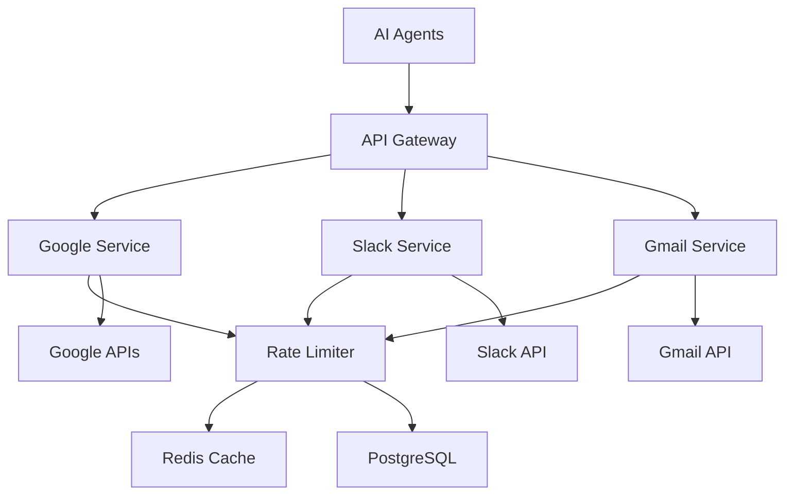

# 🎨 CREATIVE PHASE: External API Integration Strategy

**Date**: 2025-01-27
**Component**: External API Integration System
**Status**: Complete - Design Decision Made
**Priority**: High - Required for core Clarity v2 functionality (Slack Digest, Reply Drafter, Auto-Scheduler agents)

## Problem Statement

Design a comprehensive external API integration strategy for Clarity v2 that handles Google Calendar, Gmail, and Slack APIs with proper rate limiting, data synchronization, error handling, and user privacy compliance. The system must work with the existing PostgreSQL infrastructure and support the AI agents (Slack Digest, Reply Drafter, Auto-Scheduler) while maintaining data security and performance.

## Requirements Analysis

### Functional Requirements
- **Multi-API Support**: Google Calendar, Gmail, Slack APIs
- **Rate Limiting**: Respect API limits and implement intelligent backoff
- **Data Synchronization**: Efficient sync with local database
- **Error Handling**: Graceful degradation and retry logic
- **Authentication**: OAuth2 flow management and token refresh
- **Privacy Compliance**: Data minimization and user consent

### Technical Constraints
- **Existing Infrastructure**: Must work with PostgreSQL, FastAPI, Supabase
- **Agent Integration**: Support for AI agents using external data
- **Performance**: Minimize API calls while maintaining data freshness
- **Security**: Secure token storage and transmission
- **Scalability**: Support multiple users with different API quotas

### Quality Criteria
- **Reliability**: 99.9% uptime for critical integrations
- **Efficiency**: Intelligent caching and batch operations
- **Compliance**: GDPR, OAuth2, and API provider terms compliance
- **Maintainability**: Clear abstraction layers and testable components

## Options Analysis

### Option 1: Service-Oriented API Abstraction Layer ✅ SELECTED
**Description**: Dedicated service classes for each API with common interface and shared infrastructure

**Pros**:
- Clear separation of concerns
- Reusable rate limiting and caching
- Easy to test and mock
- Consistent error handling
- Scalable architecture

**Cons**:
- Higher initial complexity
- More abstraction layers
- Potential over-engineering
- Requires careful interface design

**Complexity**: Medium-High | **Implementation Time**: 4-5 weeks | **Maintainability**: High

### Option 2: Plugin-Based Integration System
**Description**: Pluggable integration modules with dynamic loading and configuration

**Pros**:
- Highly extensible
- Easy to add new integrations
- Configuration-driven
- Hot-swappable plugins
- Modular development

**Cons**:
- Complex plugin architecture
- Potential runtime issues
- Harder to debug
- Over-engineered for current needs
- Plugin versioning complexity

**Complexity**: High | **Implementation Time**: 6-7 weeks | **Maintainability**: Medium

### Option 3: Direct Integration with Shared Utilities
**Description**: Direct API integrations with shared utility functions for common concerns

**Pros**:
- Simple and direct
- Fast to implement
- Easy to understand
- Minimal abstraction
- Quick time to market

**Cons**:
- Code duplication
- Inconsistent patterns
- Harder to maintain
- Limited reusability
- Potential for divergent implementations

**Complexity**: Low-Medium | **Implementation Time**: 2-3 weeks | **Maintainability**: Low

### Option 4: Event-Driven Integration Hub
**Description**: Central integration hub with event-driven data flow and async processing

**Pros**:
- Excellent scalability
- Async processing
- Fault tolerance
- Event-driven architecture
- Good for high-volume operations

**Cons**:
- Complex event management
- Eventual consistency issues
- Harder to debug
- Requires queue infrastructure
- Over-engineered for current scale

**Complexity**: High | **Implementation Time**: 5-6 weeks | **Maintainability**: Medium

## Decision Rationale

**Selected Option**: Service-Oriented API Abstraction Layer (Option 1)

**Primary Factors**:
1. **Maintainability**: Clear separation of concerns essential for long-term maintenance
2. **Agent Integration**: AI agents need consistent, reliable API access patterns
3. **Rate Limiting**: Shared infrastructure prevents API quota violations
4. **Existing Infrastructure**: Fits well with current FastAPI service architecture
5. **Future Extensibility**: Easy to add new APIs without architectural changes

**Why Not Other Options**:
- **Option 2 (Plugin-Based)**: Over-engineered for current needs, adds unnecessary complexity
- **Option 3 (Direct Integration)**: Will lead to maintenance issues as we add more APIs
- **Option 4 (Event-Driven)**: Too complex for current scale, eventual consistency issues

## Implementation Guidelines

### Architecture Overview


### Key Components

1. **BaseAPIService**: Abstract base class with common functionality (rate limiting, caching, auth)
2. **Concrete Services**: GoogleCalendarService, SlackService, GmailService
3. **APIGateway**: Central coordinator for all external API access
4. **RateLimiter**: Per-service and per-user rate limiting with intelligent backoff
5. **AuthManager**: OAuth2 token management with secure storage and refresh
6. **CacheManager**: Intelligent caching with TTL and invalidation strategies

### Service Interface Design
```python
class BaseAPIService(ABC):
    @abstractmethod
    async def authenticate(self, user_id: str) -> bool
    
    @abstractmethod
    async def refresh_token(self, user_id: str) -> bool
    
    async def make_request(self, user_id: str, endpoint: str, method: str = "GET", **kwargs)
```

### Rate Limiting Strategy
- **Google Calendar**: 100 requests/minute, 1M requests/day
- **Slack**: 50 requests/minute, 4K requests/hour
- **Gmail**: 250 requests/minute, 1B requests/day
- **Intelligent Backoff**: Exponential backoff with jitter
- **User-based Quotas**: Per-user tracking to prevent quota exhaustion

### Caching Strategy
- **Calendar Events**: 15-minute TTL for event lists
- **Slack Messages**: 5-minute TTL for recent messages
- **Gmail Threads**: 10-minute TTL for thread lists
- **Pattern-based Invalidation**: Smart cache invalidation on updates

### Security Considerations
- **Token Encryption**: All OAuth tokens encrypted at rest
- **Secure Transmission**: HTTPS only for all API communications
- **Token Rotation**: Automatic refresh before expiration
- **Audit Logging**: All API access logged for security monitoring

## Implementation Priority

### Phase 1: Core Infrastructure (2-3 weeks)
- BaseAPIService abstract class
- RateLimiter implementation
- AuthManager with token storage
- Basic CacheManager

### Phase 2: Service Implementations (2-3 weeks)
- GoogleCalendarService
- SlackService (basic functionality)
- GmailService (basic functionality)
- APIGateway coordination

### Phase 3: Agent Integration (1-2 weeks)
- Slack Digest Agent integration
- Reply Drafter Agent integration
- Auto-Scheduler Agent integration

### Phase 4: Advanced Features (1-2 weeks)
- Advanced caching strategies
- Performance optimization
- Monitoring and alerting

## Verification

✅ **Requirements Met**:
- Multi-API support with consistent interface
- Rate limiting with per-service and per-user quotas
- Data synchronization with intelligent caching
- Error handling with retry logic and graceful degradation
- OAuth2 authentication with secure token management
- Privacy compliance with encrypted token storage

✅ **Technical Constraints**:
- Integrates with existing PostgreSQL and FastAPI infrastructure
- Supports AI agents with consistent data access patterns
- Minimizes API calls through intelligent caching
- Secure token storage with encryption
- Scalable architecture supporting multiple users

✅ **Quality Criteria**:
- Reliability through retry logic and error handling
- Efficiency with caching and batch operations
- Compliance with OAuth2 and data protection standards
- Maintainability with clear service abstractions

## Agent Integration Examples

### Slack Digest Agent
```python
async def generate_digest(self, user_id: str) -> str:
    slack_service = await self.api_gateway.get_service('slack')
    mentions = await slack_service.get_mentions(user_id, hours=24)
    channels = await slack_service.get_channel_updates(user_id, hours=24)
    return await self._generate_summary(mentions, channels)
```

### Auto-Scheduler Agent
```python
async def find_available_slots(self, user_id: str, duration: int) -> List[TimeSlot]:
    calendar_service = await self.api_gateway.get_service('google_calendar')
    events = await calendar_service.get_events(user_id, start_date, end_date)
    return self._calculate_free_slots(events, duration)
```

### Reply Drafter Agent
```python
async def draft_reply(self, user_id: str, message_id: str) -> str:
    gmail_service = await self.api_gateway.get_service('gmail')
    thread = await gmail_service.get_thread(user_id, message_id)
    context = await self._extract_context(thread)
    return await self._generate_reply(context)
``` 