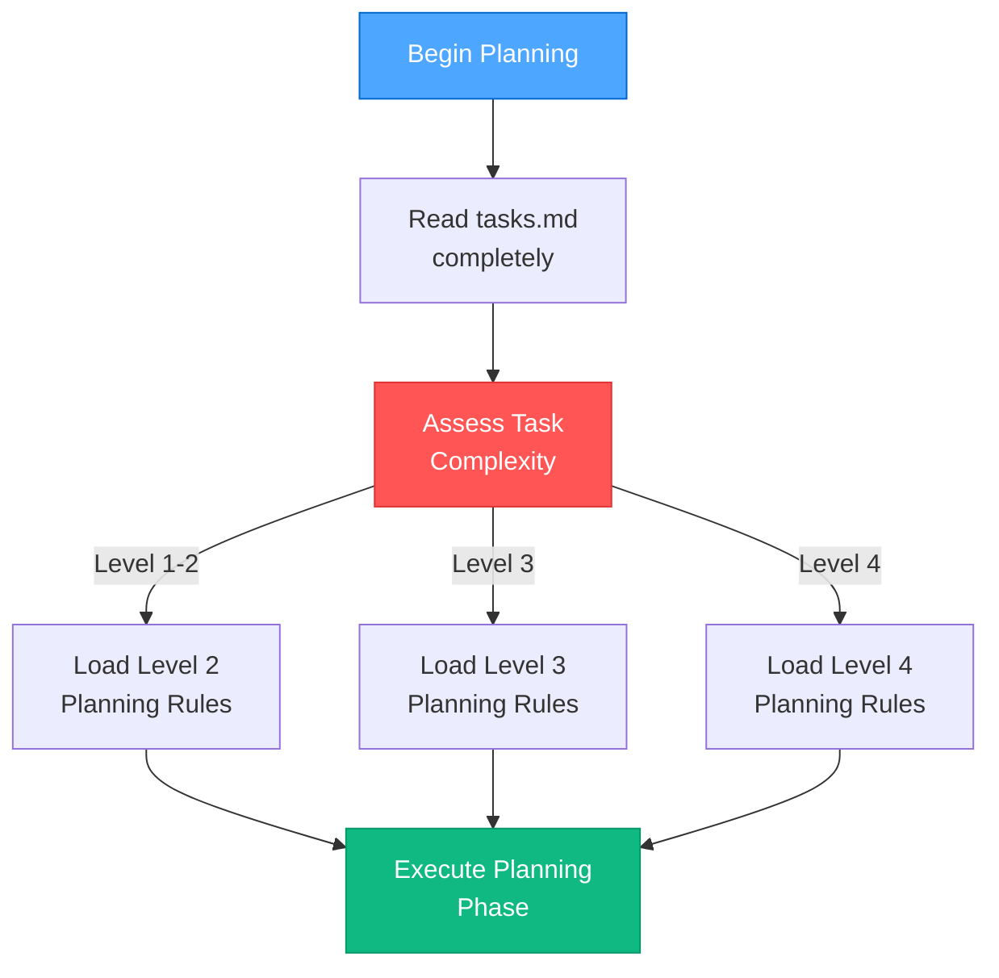
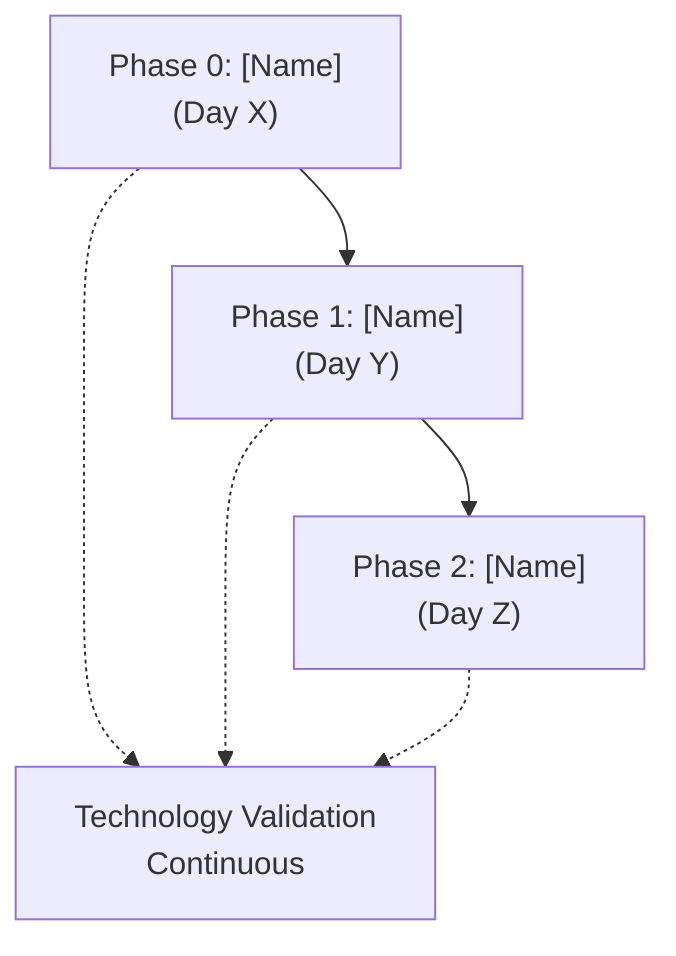

# FORMALIZED PLANNING INSTRUCTIONS FOR MEMORY BANK AGENTS

**Version**: 1.0  
**Date**: January 30, 2025  
**Status**: ACTIVE  
**Scope**: All Memory Bank planning activities

## 🎯 PURPOSE

This document provides explicit, step-by-step instructions for agents to create consistent, comprehensive plans following the Memory Bank methodology. It ensures all plans meet the same quality standards and include all required elements.

## 📋 MANDATORY PLANNING WORKFLOW

### Step 1: Complexity Assessment and Rule Loading



**Required Actions**:
1. **Read Complete Context**: Always read `tasks.md` entirely before beginning
2. **Load Appropriate Rules**: Use `fetch_rules` to load complexity-specific planning guidelines
3. **Verify Memory Bank State**: Ensure all required Memory Bank files exist

### Step 2: Requirements Analysis (ALL LEVELS)

#### Core Requirements Documentation
```markdown
### 📋 REQUIREMENTS ANALYSIS

#### Core Requirements
- [x] **R1**: [Requirement description with clear acceptance criteria]
- [x] **R2**: [Requirement description with clear acceptance criteria]
- [x] **R3**: [Requirement description with clear acceptance criteria]

#### Technical Constraints
- [x] **C1**: [Constraint description with impact assessment]
- [x] **C2**: [Constraint description with impact assessment]
- [x] **C3**: [Constraint description with impact assessment]

#### Non-Functional Requirements
- **Performance**: [Specific metrics and targets]
- **Scalability**: [Specific metrics and targets]
- **Maintainability**: [Specific metrics and targets]
- **Type Safety**: [Specific metrics and targets]
- **Reliability**: [Specific metrics and targets]
```

**Mandatory Elements**:
- ✅ Each requirement must have clear acceptance criteria
- ✅ Constraints must include impact assessment
- ✅ Non-functional requirements must have measurable targets
- ✅ All requirements must be marked as analyzed `[x]`

### Step 3: Architectural Analysis (LEVEL 3-4 ONLY)

#### System Components Analysis
```markdown
### 🏗️ ARCHITECTURAL ANALYSIS

#### System Components Affected
1. **[Component Name] ([Location])**
   - [Specific changes needed]
   - [Dependencies affected]
   - [Integration points]

2. **[Component Name] ([Location])**
   - [Specific changes needed]
   - [Dependencies affected]
   - [Integration points]

#### Dependencies & Integration Points
- **[System A] ↔ [System B]**: [Description of interaction]
- **[System B] ↔ [System C]**: [Description of interaction]
- **[System C] ↔ [System D]**: [Description of interaction]
```

**Mandatory Elements**:
- ✅ All affected components must be identified with specific locations
- ✅ Changes needed for each component must be detailed
- ✅ Integration points must be explicitly documented
- ✅ Dependencies must show bidirectional relationships where applicable

### Step 4: Technology Stack Validation (ALL LEVELS)

#### Technology Selection and Validation
```markdown
### 🔧 TECHNOLOGY STACK VALIDATION

#### Selected Technologies
- **[Category]**: [Selected technology with justification]
- **[Category]**: [Selected technology with justification]
- **[Category]**: [Selected technology with justification]

#### Technology Validation Checkpoints
- [ ] **TV1**: [Specific validation checkpoint]
- [ ] **TV2**: [Specific validation checkpoint]
- [ ] **TV3**: [Specific validation checkpoint]
- [ ] **TV4**: [Specific validation checkpoint]
```

**Mandatory Elements**:
- ✅ Every technology choice must include justification
- ✅ Validation checkpoints must be specific and testable
- ✅ Minimum 4 validation checkpoints required
- ✅ Each checkpoint must have clear pass/fail criteria

### Step 5: Implementation Strategy (ALL LEVELS)

#### Phased Implementation Approach
```markdown
### 📊 IMPLEMENTATION STRATEGY

#### Phased Implementation Approach


#### Detailed Implementation Steps

##### Phase X: [Phase Name] (Day X) - [STATUS]
**Objective**: [Clear, measurable objective]

**Technology Validation Required**: [Specific validation needs]

**Tasks**:
- [ ] **X.1 [Task Name]**
  - [Specific subtask with clear deliverable]
  - [Specific subtask with clear deliverable]
  - [Specific subtask with clear deliverable]

**Technology Validation Checkpoints**:
- [ ] [Specific checkpoint with pass/fail criteria]
- [ ] [Specific checkpoint with pass/fail criteria]
```

**Mandatory Elements**:
- ✅ Each phase must have clear, measurable objectives
- ✅ Technology validation requirements must be specified
- ✅ Tasks must be broken down into specific, actionable subtasks
- ✅ Each phase must include technology validation checkpoints
- ✅ Phases must be sequenced logically with dependencies

### Step 6: Creative Phase Identification (LEVEL 3-4 ONLY)

#### Creative Phase Documentation
```markdown
### 🎨 CREATIVE PHASES REQUIRED

#### [Phase Name] Design Phase
- **Component**: [Specific component requiring design]
- **Decisions Required**: 
  - [Specific design decision needed]
  - [Specific design decision needed]
  - [Specific design decision needed]
- **Status**: [🔄 REQUIRED during Phase X / ✅ COMPLETE]

#### [Phase Name] Design Phase
- **Component**: [Specific component requiring design]
- **Decisions Required**:
  - [Specific design decision needed]
  - [Specific design decision needed]
- **Status**: [🔄 REQUIRED during Phase X / ✅ COMPLETE]
```

**Mandatory Elements**:
- ✅ Each creative phase must specify the exact component
- ✅ Design decisions must be specific and actionable
- ✅ Status must indicate when the creative phase is needed
- ✅ Creative phases must be tied to specific implementation phases

### Step 7: Risk Management (ALL LEVELS)

#### Challenges and Mitigations
```markdown
### ⚠️ CHALLENGES & MITIGATIONS

#### Challenge 1: [Specific Challenge Name]
- **Risk**: [Detailed description of the risk]
- **Mitigation**: [Specific mitigation strategy]
- **Validation**: [How success of mitigation will be measured]

#### Challenge 2: [Specific Challenge Name]
- **Risk**: [Detailed description of the risk]
- **Mitigation**: [Specific mitigation strategy]
- **Validation**: [How success of mitigation will be measured]
```

**Mandatory Elements**:
- ✅ Minimum 3 challenges must be identified for Level 3-4 tasks
- ✅ Each risk must include specific mitigation strategy
- ✅ Validation criteria must be measurable
- ✅ Challenges must be realistic and project-specific

### Step 8: Success Metrics (ALL LEVELS)

#### Measurable Success Criteria
```markdown
### 📊 SUCCESS METRICS

#### [Metric Category] Metrics
- **Target**: [Specific, measurable target]
- **Measurement**: [How the metric will be measured]
- **Current**: [Current baseline if applicable]

#### [Metric Category] Metrics
- **Target**: [Specific, measurable target]
- **Measurement**: [How the metric will be measured]
- **Validation**: [How success will be validated]
```

**Mandatory Elements**:
- ✅ All metrics must be specific and measurable
- ✅ Measurement methodology must be clearly defined
- ✅ Targets must be realistic and achievable
- ✅ Validation criteria must be objective

### Step 9: Memory Bank Integration (ALL LEVELS)

#### Memory Bank File Updates
```markdown
### 🔄 MEMORY BANK INTEGRATION

#### Files Updated During Planning
- [x] **tasks.md**: [Description of updates made]
- [x] **[other-file].md**: [Description of updates made]
- [ ] **[future-file].md**: [Description of updates needed]

#### Next Mode Recommendation
**NEXT MODE**: [MODE NAME] ([Specific Phase])
- [Specific reason for mode recommendation]
- [Focus area for next mode]
- [Key validation requirements]
```

**Mandatory Elements**:
- ✅ All Memory Bank file updates must be documented
- ✅ Next mode recommendation must be specific
- ✅ Reasoning for mode transition must be provided
- ✅ Key requirements for next mode must be specified

### Step 10: Planning Verification (ALL LEVELS)

#### Comprehensive Verification Checklist
```markdown
### 🚨 PLANNING VERIFICATION CHECKLIST

```
✓ [LEVEL X] PLANNING VERIFICATION CHECKLIST

Requirements Analysis
- [x] Functional requirements analyzed and documented
- [x] Non-functional requirements specified with metrics
- [x] Technical constraints identified and addressed
- [x] Domain model and component identification complete

[Additional sections based on complexity level]

→ PLANNING COMPLETE: Ready for [NEXT MODE] with [Specific Focus]
```
```

**Mandatory Elements**:
- ✅ All checklist items must be marked as complete `[x]`
- ✅ Checklist must be appropriate for complexity level
- ✅ Final status must indicate readiness for next mode
- ✅ Specific focus for next mode must be provided

## 📊 COMPLEXITY-SPECIFIC REQUIREMENTS

### Level 1-2: Simple Enhancement Planning

**Required Sections**:
1. Requirements Analysis (simplified)
2. Technology Stack Validation
3. Implementation Strategy (linear)
4. Risk Management (basic)
5. Success Metrics
6. Memory Bank Integration
7. Planning Verification

**Simplified Format**:
- Linear implementation plan
- Basic technology validation
- 2-3 challenges identified
- Direct implementation approach

### Level 3: Intermediate Feature Planning

**Required Sections**:
1. Requirements Analysis (detailed)
2. Architectural Analysis (component-focused)
3. Technology Stack Validation
4. Implementation Strategy (phased)
5. Creative Phase Identification
6. Risk Management (comprehensive)
7. Success Metrics
8. Memory Bank Integration
9. Planning Verification

**Enhanced Format**:
- Multi-phase implementation
- Component dependency mapping
- Creative phases identified
- Comprehensive risk assessment

### Level 4: Complex System Planning

**Required Sections**:
1. Requirements Analysis (comprehensive)
2. Architectural Analysis (system-wide)
3. Technology Stack Validation
4. Implementation Strategy (phased with dependencies)
5. Creative Phase Identification (multiple phases)
6. Risk Management (enterprise-level)
7. Success Metrics (multi-dimensional)
8. Memory Bank Integration
9. Planning Verification

**Comprehensive Format**:
- System-wide impact analysis
- Multiple creative phases
- Enterprise-level risk management
- Multi-dimensional success metrics

## 🔧 AGENT EXECUTION INSTRUCTIONS

### Before Starting Planning

1. **Read Complete Context**
   ```
   read_file({
     target_file: "memory-bank/tasks.md",
     should_read_entire_file: true
   })
   ```

2. **Load Appropriate Rules**
   ```
   fetch_rules([
     "isolation_rules/main",
     "isolation_rules/Level[X]/planning-comprehensive",
     "isolation_rules/visual-maps/plan-mode-map"
   ])
   ```

3. **Verify Memory Bank State**
   - Confirm `tasks.md` exists and is initialized
   - Verify `activeContext.md` is present
   - Check for any existing creative phase documents

### During Planning

1. **Follow Template Exactly**
   - Use the exact section headers provided
   - Include all mandatory elements
   - Mark completed items with `[x]`

2. **Maintain Consistency**
   - Use consistent terminology throughout
   - Reference specific file paths and components
   - Ensure all cross-references are accurate

3. **Validate Completeness**
   - Check each section against mandatory elements
   - Verify all technology validation checkpoints are included
   - Confirm success metrics are measurable

### After Planning

1. **Update tasks.md**
   - Replace existing content with formalized plan
   - Ensure all sections are complete
   - Verify formatting is consistent

2. **Complete Verification Checklist**
   - Mark all items as complete `[x]`
   - Provide specific next mode recommendation
   - Document any remaining dependencies

3. **Notify User**
   ```
   ## PLANNING COMPLETE

   ✅ [Level X] planning methodology applied
   ✅ All mandatory sections included
   ✅ Technology validation checkpoints established
   ✅ Success metrics defined
   ✅ Memory Bank integration complete

   → NEXT RECOMMENDED MODE: [MODE NAME]
   ```

## 🚨 QUALITY ASSURANCE REQUIREMENTS

### Mandatory Quality Checks

1. **Completeness Check**
   - All required sections present
   - All mandatory elements included
   - All checklists marked complete

2. **Consistency Check**
   - Terminology used consistently
   - Cross-references are accurate
   - Formatting follows template exactly

3. **Measurability Check**
   - Success metrics are quantifiable
   - Validation checkpoints are testable
   - Objectives are specific and achievable

4. **Feasibility Check**
   - Implementation phases are realistic
   - Technology choices are justified
   - Risk mitigations are actionable

### Common Quality Issues to Avoid

❌ **Vague Requirements**: "Improve performance" → ✅ "Response time < 200ms"  
❌ **Missing Validation**: No technology checkpoints → ✅ Specific validation criteria  
❌ **Unclear Phases**: "Set up system" → ✅ "Create directory structure and validate Supabase CLI"  
❌ **Unmeasurable Metrics**: "Better user experience" → ✅ "User task completion rate > 95%"  

## 📋 TEMPLATE COMPLIANCE MATRIX

| Element | Level 1-2 | Level 3 | Level 4 | Required Format |
|---------|-----------|---------|---------|-----------------|
| Requirements Analysis | Basic | Detailed | Comprehensive | Numbered requirements with acceptance criteria |
| Architectural Analysis | N/A | Component-focused | System-wide | Component mapping with dependencies |
| Technology Validation | Basic | Standard | Comprehensive | Minimum 4 checkpoints with pass/fail criteria |
| Implementation Strategy | Linear | Phased | Multi-phased | Mermaid diagram + detailed steps |
| Creative Phases | N/A | Identified | Multiple | Component-specific with decision requirements |
| Risk Management | 2-3 risks | 3-4 risks | 4+ risks | Risk + Mitigation + Validation format |
| Success Metrics | Basic | Multi-category | Multi-dimensional | Target + Measurement + Validation |
| Memory Bank Integration | Standard | Standard | Standard | File updates + next mode recommendation |
| Verification Checklist | Level-appropriate | Level-appropriate | Level-appropriate | All items marked complete |

## 🔄 CONTINUOUS IMPROVEMENT

### Feedback Integration

Agents should:
1. **Document Deviations**: If template doesn't fit, document why and propose improvements
2. **Track Effectiveness**: Note which planning elements were most/least useful during implementation
3. **Suggest Enhancements**: Propose template improvements based on real-world usage

### Template Evolution

This template will be updated based on:
- Agent feedback and usage patterns
- Implementation success rates
- User satisfaction with planning quality
- Emerging best practices

**Version History**:
- v1.0 (Jan 30, 2025): Initial formalized template based on Clarity v2 planning example

---

**Remember**: This template ensures consistency and quality across all Memory Bank planning activities. Following it exactly will produce comprehensive, actionable plans that set up implementation for success. 