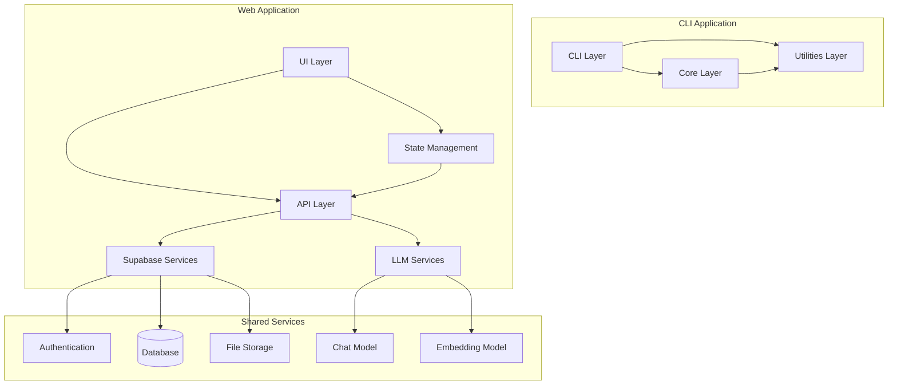
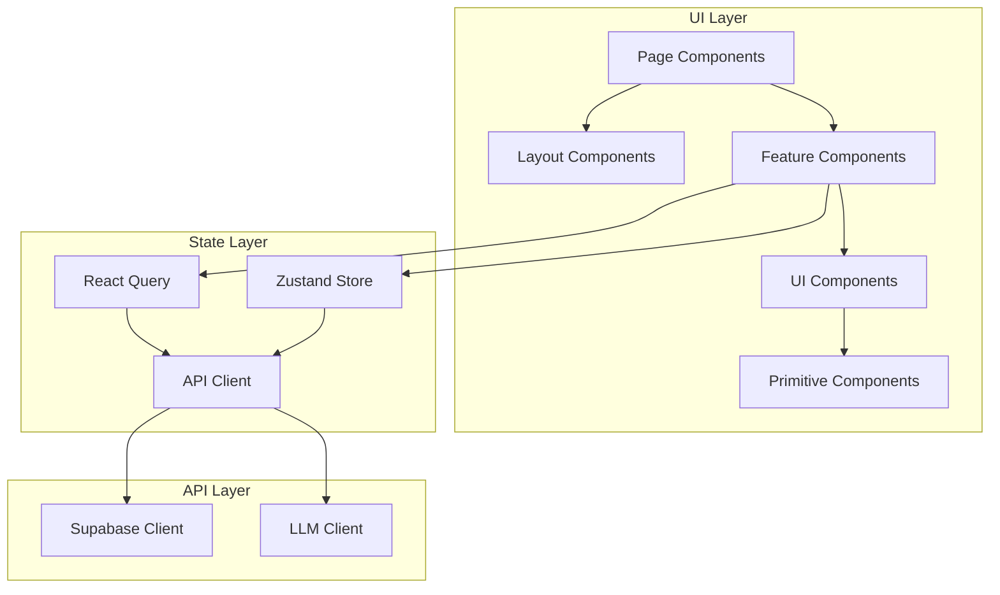
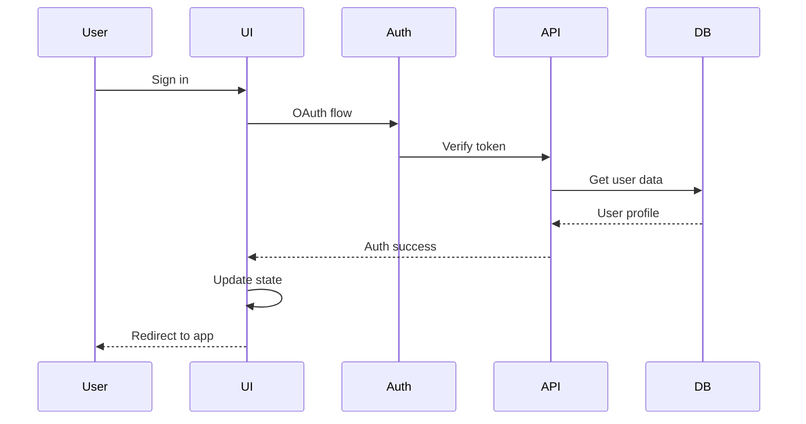
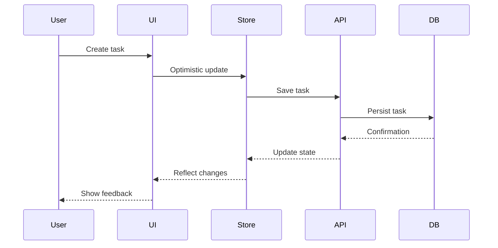
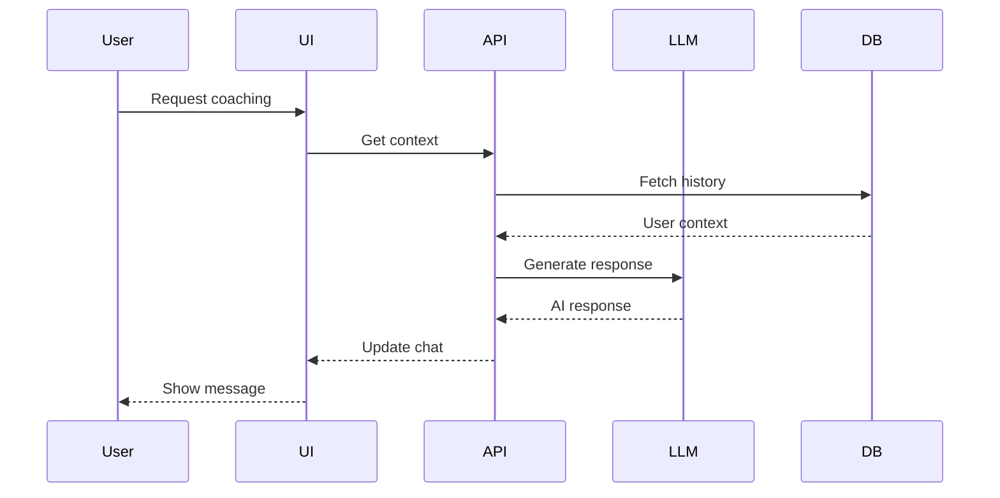

# System Patterns

This document outlines the system architecture, key technical decisions, design patterns, component relationships, and critical implementation paths for both the CLI and web applications.

## System Architecture

The system follows a modular architecture with clear separation of concerns:



### Directory Structure

```
/
├── cli/                    # CLI Application
│   ├── config/            # Static configuration
│   ├── data/              # Dynamic runtime data
│   ├── src/               # Python source code
│   └── tests/             # CLI tests
│
├── web/                    # Web Application
│   ├── apps/
│   │   ├── web/          # Main web application
│   │   └── api/          # Serverless API functions
│   ├── packages/          # Shared packages
│   │   ├── ui/           # Shared UI components
│   │   ├── config/       # Shared configuration
│   │   └── types/        # Shared TypeScript types
│   └── tests/            # Frontend tests
│
└── docs/                   # Project documentation
```

## Key Technical Decisions

### 1. Modular Code Organization
- Clear separation between CLI, web UI, and shared services
- Each module has a single responsibility
- Shared types and utilities between CLI and web
- Component-based architecture for UI
- Monorepo structure for shared code

### 2. State Management
- React Query for server state
- Zustand for client state
- Immutable state updates
- Optimistic updates for better UX
- Offline support with sync

### 3. UI Component Architecture
- Atomic Design principles
- Headless UI components for accessibility
- Composition over inheritance
- Custom hooks for shared logic
- CSS-in-JS with Tailwind

### 4. Data Flow
- Unidirectional data flow
- Server state synchronization
- Real-time updates via Supabase
- Optimistic UI updates
- Error boundary handling

### 5. Authentication & Authorization
- OAuth 2.0 with Supabase
- Row-level security
- Role-based access control
- Session management
- Secure token handling

## Design Patterns

### 1. Frontend Patterns
- **Container/Presenter Pattern**
  - Container components handle data and logic
  - Presenter components handle rendering
  - Clear separation of concerns

- **Custom Hook Pattern**
  - Encapsulate reusable logic
  - Share stateful logic between components
  - Handle side effects consistently

- **Compound Components**
  - Flexible component composition
  - Shared context between related components
  - Reduced prop drilling

- **Render Props**
  - Share code between components
  - Dynamic component rendering
  - Flexible component composition

### 2. State Management Patterns
- **Command Pattern**
  - Actions as first-class objects
  - Undo/redo support
  - Transaction-like operations

- **Observer Pattern**
  - Real-time updates
  - Event-driven architecture
  - Pub/sub for state changes

- **Repository Pattern**
  - Abstract data access
  - Consistent data operations
  - Caching and optimization

### 3. API Patterns
- **Gateway Pattern**
  - Single entry point for API calls
  - Consistent error handling
  - Request/response transformation

- **Circuit Breaker**
  - Handle API failures gracefully
  - Prevent cascading failures
  - Fallback mechanisms

- **CQRS Pattern**
  - Separate read and write operations
  - Optimize for different use cases
  - Better scalability

## Component Relationships



### Key Component Responsibilities

1. **Page Components**
   - Route handling
   - Layout composition
   - Feature composition
   - Error boundaries

2. **Feature Components**
   - Business logic
   - State management
   - API integration
   - User interactions

3. **UI Components**
   - Presentational logic
   - Accessibility
   - Responsive design
   - Animation

4. **Primitive Components**
   - Basic building blocks
   - Headless UI integration
   - Consistent styling
   - Reusable patterns

## Critical Implementation Paths

### 1. Authentication Flow



### 2. Task Management Flow



### 3. AI Coaching Flow



## Implementation Notes

### 1. UI Component Guidelines
- Use TypeScript for type safety
- Follow atomic design principles
- Implement accessibility first
- Use CSS-in-JS with Tailwind
- Support dark/light themes

### 2. State Management
- Use React Query for server state
- Use Zustand for client state
- Implement optimistic updates
- Handle loading states
- Manage error states

### 3. API Integration
- Use generated API clients
- Implement retry logic
- Handle rate limiting
- Cache responses
- Manage offline state

### 4. Performance Optimization
- Code splitting
- Lazy loading
- Image optimization
- Bundle analysis
- Performance monitoring

### 5. Testing Strategy
- Unit tests for utilities
- Component tests
- Integration tests
- E2E tests
- Performance tests

### 6. Security Considerations
- Input validation
- XSS prevention
- CSRF protection
- Rate limiting
- Data encryption

### 7. Accessibility Standards
- WCAG 2.1 compliance
- Keyboard navigation
- Screen reader support
- Color contrast
- Focus management

## Web Application Architecture Details

The Clarity web application extends the general system architecture with specific components for delivering the AI coaching experience via a web interface.

```mermaid
graph TD
    subgraph "User Browser"
        WebAppUI["Clarity Web App (React/Vite)"]
    end

    subgraph "Web Server Infrastructure (Conceptual)"
        WebAppUI --> ViteDevServer["Vite Dev Server (localhost:3000)"]
        ViteDevServer --> Proxy
        Proxy["Proxy (/api)"] --> FastAPIApp["Clarity API (FastAPI on localhost:3001)"]
    end

    subgraph "Backend Services (Python - llm-agent project)"
        FastAPIApp --> PythonAgentCore["Python Agent Core (src/core, src/utils)"]
        PythonAgentCore --> LLMServices["LLM Services (LangChain)"]
        PythonAgentCore --> AgentData["Agent Data (config/ & data/ users/USER_ID/agents/AGENT_ID)"]
    end

    Supabase[Supabase Services] --> AuthN["Authentication"]
    Supabase --> UserDB[(User Database)]
    WebAppUI --> Supabase
    FastAPIApp --> Supabase # For user auth verification if needed by API directly

```

### Key Components & Decisions (Web App Focus):

*   **Frontend (`web/apps/web`):** Built with React, Vite, and TypeScript. Uses Zustand for client-state management (e.g., chat panel visibility, messages) and React Query (planned) for server-state. Interacts with `@clarity/ui` for shared UI components.
*   **UI Package (`web/packages/ui`):** Contains reusable React components, hooks, and styles (TailwindCSS) used by the main web application.
*   **API Application (`web/apps/api`):**
    *   A FastAPI (Python) application responsible for handling requests from the web frontend that require interaction with the Python-based LLM agent backend.
    *   **Current Endpoint:** `/api/chat` (POST) receives user messages and (will) invoke the appropriate LLM agent.
    *   **Agent Interaction:** This API layer acts as a bridge. It will load and interact with the agent logic from the root `llm-agent/src` directory.
        *   **Path Management:** Temporarily uses `sys.path` modification (via `.env` and `python-dotenv` in the API app) to locate the `llm-agent/src` modules. Long-term, the `llm-agent` project should be packaged for proper installation.
        *   **Per-User Agent Instantiation:** The API is designed with the principle of instantiating or managing agent resources (like `AgentExecutor` and its memory) on a per-user basis to ensure data isolation and context awareness. User identification will eventually come from auth tokens.
*   **AI Coaching Flow (Updated):**

    ```mermaid
    sequenceDiagram
        participant User
        participant WebAppUI as "Clarity Web App (React)"
        participant FastAPI
        participant PythonAgentCore as "Python Agent Core"
        participant LLM
        participant UserAgentData as "User-Specific Agent Data/Memory"

        User->>WebAppUI: Send Chat Message
        WebAppUI->>FastAPI: POST /api/chat (message, user_id, agent_id)
        FastAPI->>PythonAgentCore: Load/get agent for user_id, agent_id (with user_memory)
        PythonAgentCore-->>UserAgentData: Read/Write Memory
        PythonAgentCore->>LLM: Process message via AgentExecutor
        LLM-->>PythonAgentCore: Agent Response
        PythonAgentCore-->>FastAPI: Return agent response
        FastAPI-->>WebAppUI: JSON { reply: "..." }
        WebAppUI->>User: Display AI Reply
    end
    ```
