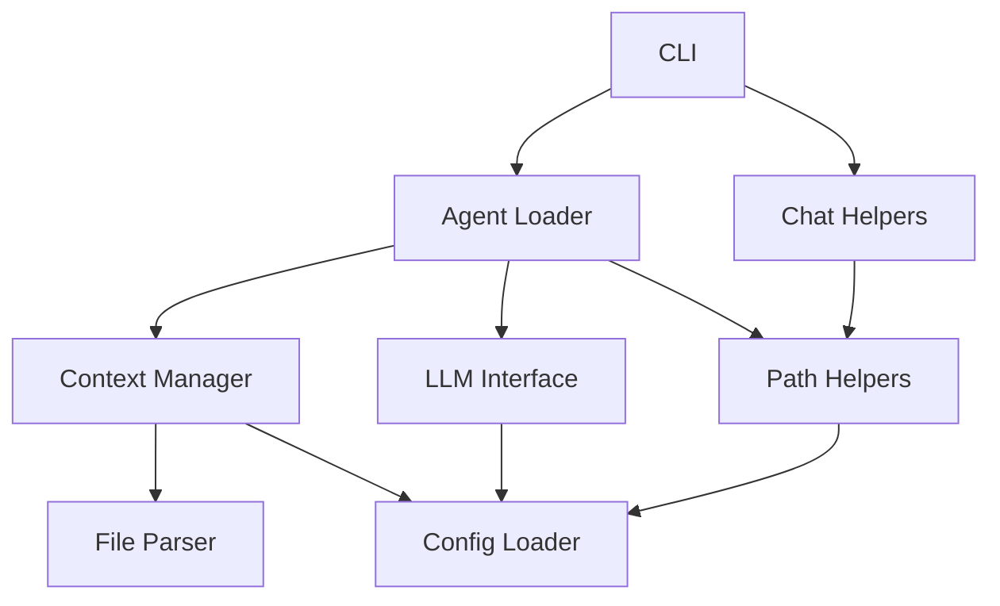
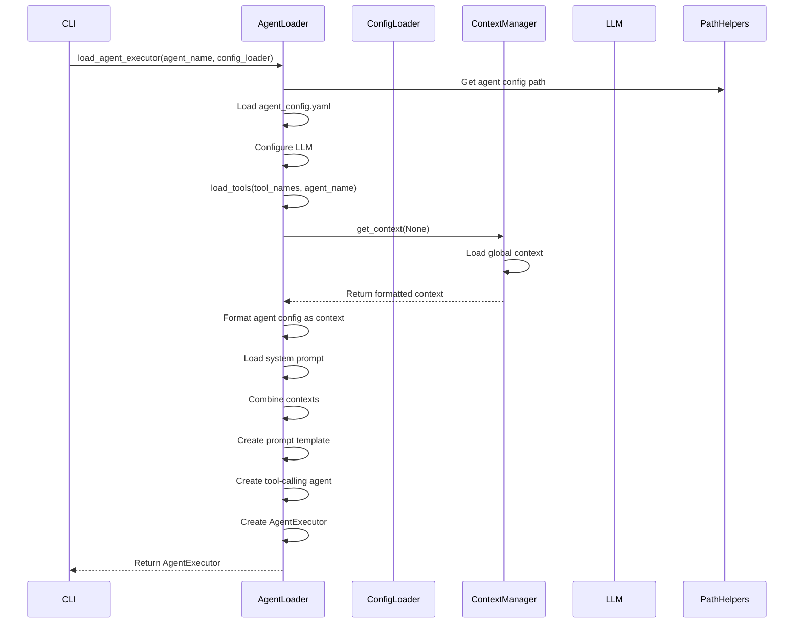
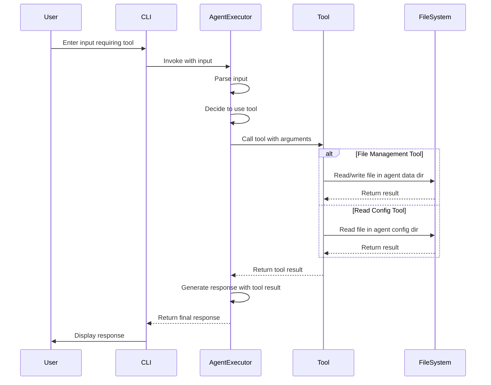

# System Patterns

This document outlines the system architecture, key technical decisions, design patterns, component relationships, and critical implementation paths of the Local LLM Terminal Environment.

## System Architecture

The system follows a modular architecture with clear separation of concerns:


### Directory Structure

```
/
├── config/                  # Static configuration
│   ├── settings.yaml        # Global settings
│   └── agents/              # Agent-specific configurations
│       └── <agent_name>/    # Per-agent configuration
│           ├── agent_config.yaml  # Agent configuration
│           └── system_prompt.md   # Agent system prompt
├── data/                    # Dynamic runtime data
│   ├── global_context/      # Global context files
│   └── agents/              # Agent-specific data
│       └── <agent_name>/    # Per-agent data
│           ├── memory/      # Conversation memory
│           └── output/      # Agent output files
├── src/                     # Source code
│   ├── cli/                 # Command-line interface
│   ├── core/                # Core functionality
│   └── utils/               # Utility functions
└── tests/                   # Test files
```

## Key Technical Decisions

1. **Modular Code Organization**
   - Clear separation between CLI, core functionality, and utilities
   - Each module has a single responsibility
   - Path construction logic centralized in path_helpers.py
   - Agent loading logic centralized in agent_loader.py
   - Chat helper functions centralized in chat_helpers.py

2. **Configuration Management**
   - YAML-based configuration with environment variable overrides
   - Separation of static configuration (config/) from dynamic data (data/)
   - ConfigLoader class provides a unified interface for accessing configuration
   - Configuration passed via context rather than global variables

3. **LLM Integration**
   - LangChain framework for LLM interaction
   - Google Gemini as the initial LLM provider
   - LLMInterface class encapsulates LLM communication
   - AgentExecutor pattern for tool-enabled interactions

4. **Memory Management**
   - Per-agent conversation memory
   - JSON-based persistence of conversation history
   - Memory loaded on agent initialization and saved on exit/switch
   - Session summaries generated and saved for context continuity

5. **Tool Integration**
   - LangChain's FileManagementToolkit for file operations
   - Sandboxed file access (agents can only access their own directories)
   - Read-only access to configuration files
   - Read-write access to agent data directories

## Design Patterns

1. **Dependency Injection**
   - ConfigLoader passed to components that need it
   - No global variables for better testability and maintainability
   - Click context used to pass configuration through CLI commands

2. **Factory Pattern**
   - `load_agent_executor` function creates and configures AgentExecutor instances
   - `load_tools` function creates tool instances based on configuration

3. **Strategy Pattern**
   - Different agents can be loaded with different configurations
   - Tools are loaded based on agent configuration

4. **Command Pattern**
   - CLI commands implemented using Click
   - Each command is a separate function with its own options

5. **Repository Pattern**
   - ContextManager acts as a repository for context data
   - Abstracts the details of where and how context is stored

6. **Facade Pattern**
   - LLMInterface provides a simplified interface to the LangChain framework
   - Hides the complexity of LLM communication

## Component Relationships



### Key Component Responsibilities

1. **ConfigLoader**
   - Loads configuration from YAML files and environment variables
   - Provides access to configuration values via dot notation

2. **ContextManager**
   - Loads and formats context from global context directory
   - Formats context data into structured strings for LLM consumption

3. **LLMInterface**
   - Initializes and configures the LLM
   - Provides methods for generating text responses

4. **AgentLoader**
   - Loads agent configuration
   - Creates and configures AgentExecutor instances
   - Loads tools based on agent configuration

5. **ChatHelpers**
   - Manages conversation memory
   - Processes user commands
   - Generates and saves session summaries

6. **PathHelpers**
   - Provides standardized path construction functions
   - Ensures consistent directory structure access

7. **FileParser**
   - Reads and parses Markdown and YAML files
   - Handles file-related errors

## Critical Implementation Paths

### 1. CLI Initialization


### 2. Agent Loading



### 3. Chat Session Flow


### 4. Tool Usage Flow



## Implementation Notes

1. **Memory Persistence**
   - Conversation history is saved as JSON files
   - Each agent has its own memory file
   - Memory is loaded on agent initialization
   - Memory is saved on agent switch and application exit

2. **Context Loading**
   - Global context is loaded from data/global_context/
   - Agent configuration is loaded from config/agents/<agent_name>/
   - System prompt is loaded from config/agents/<agent_name>/system_prompt.md
   - Agent-specific data is stored in data/agents/<agent_name>/

3. **Tool Sandboxing**
   - Agents can only read files from their config directory
   - Agents can read and write files in their data directory
   - This prevents agents from accessing files outside their scope

4. **Error Handling**
   - Comprehensive error handling for file operations
   - Graceful degradation when files are missing
   - Detailed logging for debugging

5. **Configuration Flexibility**
   - Configuration can be overridden via environment variables
   - Default values are provided for missing configuration
   - Agent-specific configuration can override global settings
